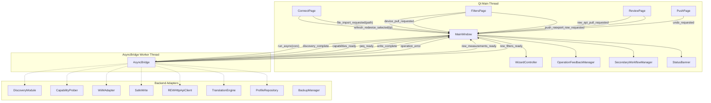
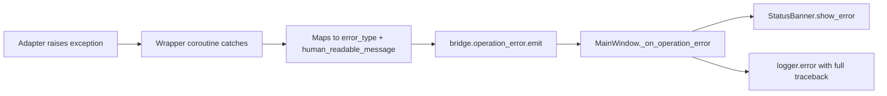
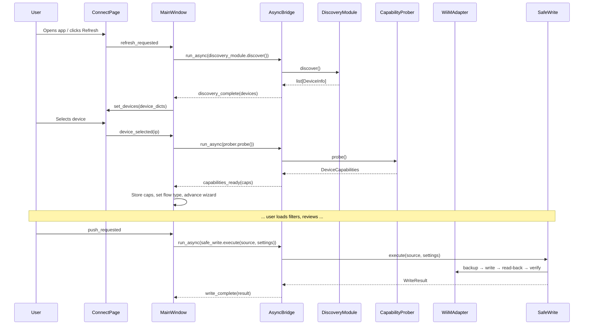

# Design Document: GUI Bridge Integration

## Overview

This feature wires the MainWindow signal handlers — currently containing TODO placeholders — to actual backend adapter methods via AsyncBridge, making the GUI functional end-to-end. The implementation connects the existing Qt signal/slot infrastructure to the proven backend adapters (DiscoveryModule, CapabilityProber, WiiMAdapter, SafeWrite, REWHttpApiClient, TranslationEngine, ProfileRepository) through the thread-safe AsyncBridge.

The design centers on three integration layers:

1. **Dependency Initialization** — MainWindow creates and holds adapter instances at startup (or lazily on device selection) so they are available for bridge calls.
2. **Signal Handler Wiring** — Each `_on_*` handler in MainWindow replaces its TODO placeholder with a `self._bridge.run_async(...)` call and appropriate result/error routing.
3. **Secondary Workflow Completion** — SecondaryWorkflowManager methods gain real async execution via AsyncBridge callbacks, replacing placeholder results with actual SafeWrite sequences.

No new data models, adapters, or GUI widgets are introduced. The work is purely integration glue.

## Architecture



### Threading Model

- **Qt Main Thread**: All GUI components, signal emissions, and slot handlers.
- **AsyncBridge Worker Thread**: Single asyncio event loop running all network I/O, file I/O, and translation coroutines.
- **Communication**: `run_async(coro)` posts coroutines from main → worker. Qt Signals (`QueuedConnection`) deliver results from worker → main.

### Error Flow



## Components and Interfaces

### 1. MainWindow Dependency Holder

MainWindow creates and holds backend adapter instances as instance attributes:

| Attribute | Type | Created When |
|-----------|------|-------------|
| `_discovery_module` | `DiscoveryModule` | `__init__` (startup) |
| `_rew_client` | `REWHttpApiClient` | `__init__` (startup) |
| `_profile_repository` | `ProfileRepository` | `__init__` (startup) |
| `_wiim_http_client` | `WiiMHttpClient \| None` | On device selection |
| `_capability_prober` | `CapabilityProber \| None` | On device selection |
| `_wiim_adapter` | `WiiMAdapter \| None` | After capabilities probed |
| `_safe_write` | `SafeWrite \| None` | After adapter created |
| `_backup_manager` | `BackupManager` | `__init__` (startup) |

### 2. Bridge Wrapper Coroutines

Each handler calls `self._bridge.run_async(coro)` where `coro` is a small async function that:
1. Executes the adapter call
2. Emits the appropriate result signal on success
3. Catches domain exceptions and emits `operation_error` on failure

Pattern:
```python
async def _do_discovery(self) -> None:
    try:
        devices = await self._discovery_module.discover()
        self._bridge.discovery_complete.emit(
            [{"name": d.name, "ip": d.ip, "model": d.model} for d in devices]
        )
    except Exception as exc:
        self._bridge.operation_error.emit(
            type(exc).__name__,
            self._map_error(exc),
        )
```

### 3. Error Mapping Interface

```python
def _map_error(self, exc: Exception) -> str:
    """Map technical exceptions to user-friendly messages."""
    mapping: dict[type, str] = {
        WiiMTimeoutError: "Device not responding",
        WiiMConnectionError: "Could not reach device",
        REWNotConnectedError: "REW is not connected",
        ParseError: f"Could not read file: {exc}",
        ValidationError: f"Invalid data: {exc}",
        FileNotFoundError: "File not found",
        PermissionError: "Permission denied",
    }
    for exc_type, message in mapping.items():
        if isinstance(exc, exc_type):
            return message
    return "An unexpected error occurred"
```

### 4. SecondaryWorkflowManager Async Execution

The SecondaryWorkflowManager gains a reference to the AsyncBridge and adapter instances (passed during `_setup_secondary_workflows`). Its methods use `bridge.run_async()` for all I/O:

```python
class SecondaryWorkflowManager(QObject):
    def configure(
        self,
        bridge: AsyncBridge,
        adapter_factory: Callable[[str], WiiMAdapter],
        safe_write_factory: Callable[[WiiMAdapter], SafeWrite],
        backup_manager: BackupManager,
    ) -> None: ...
```

### 5. New Dialogs Required

Two picker dialogs are needed for secondary workflows:

| Dialog | Purpose | Input | Output |
|--------|---------|-------|--------|
| `SourcePickerDialog` | Select target sources for copy | Available sources, excluded source | `list[str]` or `None` (cancelled) |
| `DevicePickerDialog` | Select target devices for multi-push | Discovered devices, excluded device | `list[DeviceInfo]` or `None` (cancelled) |
| `MeasurementPickerDialog` | Select REW measurement | Measurement list | `MeasurementSummary` or `None` (cancelled) |

These are modal dialogs returning values synchronously (no async needed — they present pre-fetched data).

### 6. OperationFeedbackManager Integration

The existing `OperationFeedbackManager` is already wired to `operation_started`/`operation_finished` signals from AsyncBridge. Additional integration:
- Each page registers its action buttons via `register_action_buttons()` when it becomes visible.
- The 30-second timeout (Req 13.5) is implemented as a QTimer in the feedback manager.

## Data Models

No new domain models are introduced. All data flows use existing models:

| Model | Module | Role in Integration |
|-------|--------|-------------------|
| `DeviceInfo` | `src/models/capabilities.py` | Discovery results passed to ConnectPage |
| `DeviceCapabilities` | `src/models/capabilities.py` | Probe results determining wizard flow |
| `CanonicalFilter` | `src/models/canonical.py` | Universal filter representation |
| `PEQSettings` | `src/models/peq.py` | Device read/write payload |
| `WriteResult` | `src/adapters/safe_write.py` | Push result with backup path |
| `MeasurementSummary` | `src/adapters/rew_http_client.py` | REW measurement list items |
| `Profile` | `src/models/profile.py` | Stored preset profiles |
| `ValidationWarning` | `src/translator/_warnings.py` | Skipped band warnings |
| `SourceCopyResult` | `src/gui/secondary_workflows.py` | Per-source copy results |
| `DevicePushResult` | `src/gui/secondary_workflows.py` | Per-device push results |

### Data Flow: Discovery → Device Push




## Correctness Properties

*A property is a characteristic or behavior that should hold true across all valid executions of a system — essentially, a formal statement about what the system should do. Properties serve as the bridge between human-readable specifications and machine-verifiable correctness guarantees.*

### Property 1: DeviceInfo transformation preserves required keys

*For any* list of DeviceInfo objects (with arbitrary name, ip, model, firmware, uuid values), when transformed by the discovery handler into dicts for ConnectPage, every resulting dict SHALL contain at minimum the keys "name" and "ip" with values equal to the corresponding DeviceInfo fields.

**Validates: Requirements 1.2**

### Property 2: Flow type determination from roomfit_level

*For any* DeviceCapabilities object, when roomfit_level is less than 2, the WizardController flow type SHALL be set to PEQ_ONLY; when roomfit_level is greater than or equal to 2, the flow type SHALL NOT be PEQ_ONLY.

**Validates: Requirements 2.2, 2.3**

### Property 3: Copy-to-sources fault isolation

*For any* non-empty list of target source names and any subset of those sources that fail during SafeWrite execution, the SecondaryWorkflowManager SHALL: (a) attempt a SafeWrite call for every source in the list regardless of prior failures, (b) emit exactly one SourceCopyResult per source in the results list, and (c) each result's success field SHALL accurately reflect whether that source's write succeeded or failed.

**Validates: Requirements 9.3, 9.6, 9.7**

### Property 4: Multi-device push fault isolation

*For any* non-empty list of target devices and any subset of those devices that fail during the push sequence, the SecondaryWorkflowManager SHALL: (a) attempt the full connect → probe → SafeWrite sequence for every device regardless of prior failures, (b) emit exactly one DevicePushResult per device in the results list, and (c) each result's success field SHALL accurately reflect whether that device's push succeeded or failed.

**Validates: Requirements 10.3, 10.6, 10.7**

### Property 5: Error mapping completeness

*For any* exception instance whose type is in the known mapping set (WiiMTimeoutError, WiiMConnectionError, REWNotConnectedError, ParseError, ValidationError, FileNotFoundError, PermissionError), the error mapper SHALL return the corresponding user-friendly message string. For any exception whose type is NOT in the known set, the mapper SHALL return a generic fallback message rather than raising or returning None.

**Validates: Requirements 12.2**

### Property 6: Concurrent operation prevention

*For any* operation trigger signal emitted while an existing operation is in progress (OperationFeedbackManager.is_active is True), the MainWindow SHALL ignore the trigger and NOT invoke a second run_async call, ensuring at most one operation executes at any time.

**Validates: Requirements 13.4**

## Error Handling

### Error Categories and User Messages

| Exception Type | User Message | Severity |
|---------------|-------------|----------|
| `WiiMTimeoutError` | "Device not responding" | Error |
| `WiiMConnectionError` | "Could not reach device" | Error |
| `REWNotConnectedError` | "REW is not connected" | Info (non-fatal) |
| `ParseError` | "Could not read file: {details}" | Error |
| `ValidationError` | "Invalid data: {details}" | Error |
| `FileNotFoundError` | "File not found" | Error |
| `PermissionError` | "Permission denied — file could not be written" | Error |
| `OSError` (disk full, etc.) | "File could not be written" | Error |
| Unknown `Exception` | "An unexpected error occurred" | Error |

### Error Handling Principles

1. **Never crash** — all exceptions from adapter calls are caught in the bridge wrapper coroutines.
2. **User sees plain language** — technical details (tracebacks, error codes) go to `app.log` only.
3. **Errors persist** — the StatusBanner error message remains visible until explicitly dismissed or a successful operation replaces it.
4. **Non-fatal errors don't block** — REW unavailability shows info banner but other workflows remain functional.
5. **Precondition failures are caught early** — missing source selection, empty filter list, etc. are checked before invoking the bridge.

### Error Propagation Flow

```python
async def _bridge_wrapper(self, operation_name: str, coro: Coroutine) -> None:
    """Wrap an adapter coroutine with error mapping and signal emission."""
    try:
        result = await coro
        # Emit appropriate result signal based on operation_name
    except Exception as exc:
        logger.exception("Operation '%s' failed", operation_name)
        self._bridge.operation_error.emit(
            type(exc).__name__,
            self._map_error(exc),
        )
```

### Timeout Strategy

- All network operations have a 5-second default timeout (from AppSettings.discovery_timeout).
- The OperationFeedbackManager applies a 30-second hard timeout at the UI level — if no operation_finished arrives, it force-enables buttons and shows a timeout error.
- These are independent layers: adapter timeouts are per-request; UI timeout is per-operation (which may comprise multiple requests).

## Testing Strategy

### Test Architecture

```
src/tests/
├── test_bridge_integration.py       # MainWindow signal → bridge call wiring
├── test_error_mapping.py            # Error mapper property tests
├── test_secondary_workflows_integration.py  # SWM with mocked adapters
├── test_dependency_init.py          # Startup adapter creation
└── test_operation_feedback_integration.py   # Timeout, concurrent prevention
```

### Unit Tests (Example-Based)

Unit tests verify specific scenarios with mocked adapters:

- **Discovery flow**: refresh_requested → run_async called; empty/non-empty result handling; error paths.
- **Capability flow**: device_selected → adapters created; flow type branching; source population.
- **File import**: happy path, file not found, malformed file, partial parse with warnings.
- **Device pull**: happy path, no source selected, connection failure.
- **REW API pull**: measurements listed, dialog flow, REW not connected, empty list.
- **Push flow**: success, rollback success, critical rollback failure, progress updates.
- **Export**: happy path, warnings, dialog cancel, I/O error.
- **Undo**: success, failure, backup unavailable.
- **Profile recall**: happy path, empty profile, corrupted profile.
- **Initialization**: all adapters created at correct lifecycle points.

### Property-Based Tests (Hypothesis)

Property tests validate universal properties across generated inputs.

**Library:** Hypothesis (already in project dependencies)

**Configuration:** Minimum 100 examples per property via `@settings(max_examples=100)`.

**Tag format:** Each test is tagged with `# Feature: gui-bridge-integration, Property N: <title>`.

| Property | Strategy | Generator |
|----------|----------|-----------|
| P1: DeviceInfo transformation | Generate lists of DeviceInfo with arbitrary strings | `st.lists(st_device_info())` |
| P2: Flow type from roomfit_level | Generate DeviceCapabilities with roomfit_level 0–4 | `st.integers(min_value=0, max_value=4)` |
| P3: Copy-to-sources fault isolation | Generate source lists + failure bitmap | `st.lists(st.text(min_size=1), min_size=1)` + `st.lists(st.booleans())` |
| P4: Multi-device fault isolation | Generate device lists + failure bitmap | Same pattern as P3 |
| P5: Error mapping completeness | Generate exception instances from known + unknown types | `st.sampled_from(known_types)` + `st.from_type(Exception)` |
| P6: Concurrent operation prevention | Generate pairs of operation triggers | `st.sampled_from(operation_signals)` |

### Integration Test Approach

- All GUI integration tests use **pytest-qt** (`qtbot`) for signal/slot testing.
- All adapter dependencies are **mocked** (`unittest.mock.AsyncMock`) — no real network in GUI tests.
- AsyncBridge is injected via constructor (DI pattern already in MainWindow).
- Tests use a **synchronous test bridge** that executes coroutines immediately for deterministic testing.

### Test Isolation

- Each test creates a fresh MainWindow with mocked bridge.
- No shared state between tests.
- No real filesystem access (mock Path objects for file import/export).
- No real network (all httpx calls mocked via AsyncMock).
