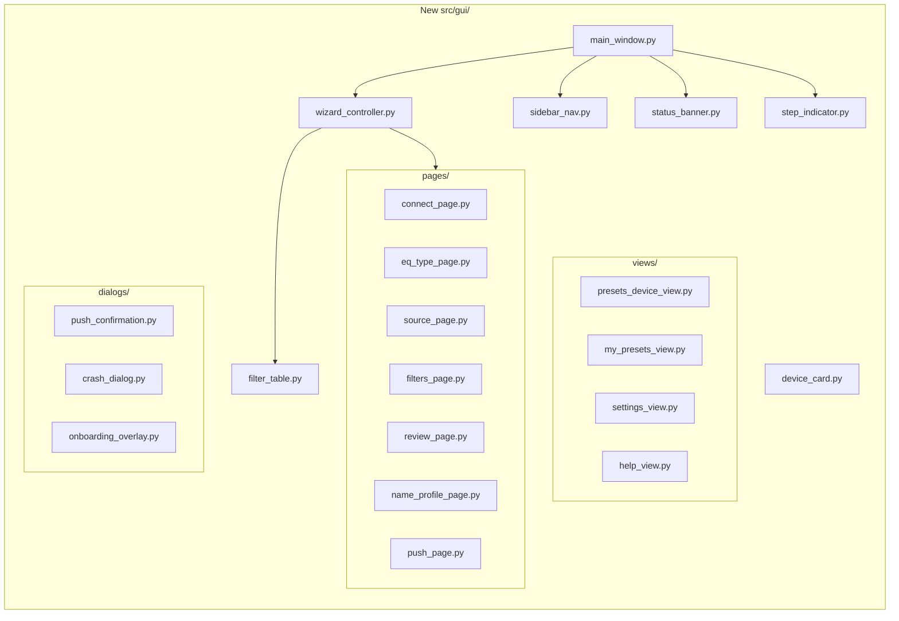
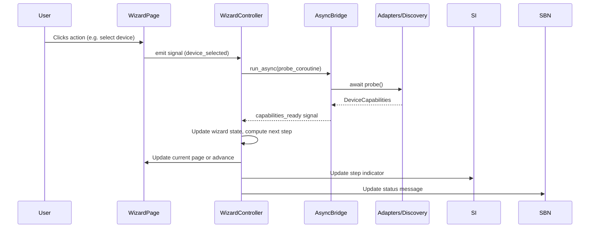
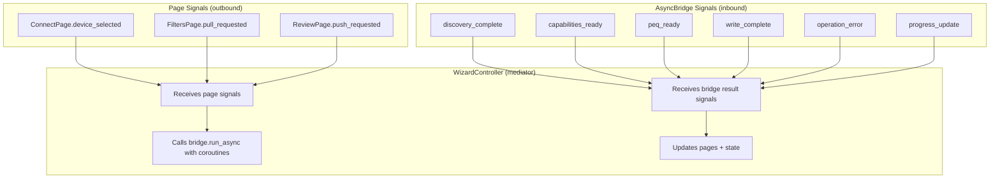
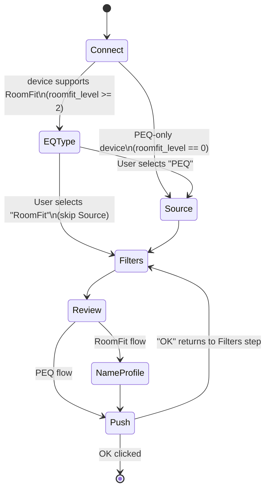
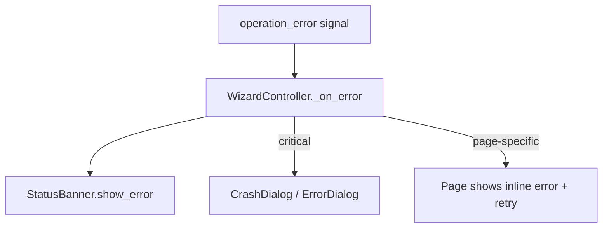

# Design Document: GUI Redesign

## Overview

This design replaces the current splitter-based panel layout (`src/gui/`) with a wizard-driven, single-pane interface using QStackedWidget for step transitions. The backend (adapters, translator, models, repository, async_bridge.py) remains unchanged. All GUI files except `async_bridge.py` are replaced.

The new architecture centers on:
- **MainWindow** — shell with Sidebar_Nav + QStackedWidget content area + Status_Banner
- **WizardController** — state machine managing step sequencing, branching, and validation
- **Page widgets** — one QWidget per wizard step, each self-contained
- **Shared components** — FilterTable, StepIndicator, DeviceCard, StatusBanner reused across views

### Design Rationale

| Decision | Rationale |
|----------|-----------|
| QStackedWidget over QSplitter | Req 14.4 — single-pane flow, no resize handles |
| Dedicated WizardController | Separates navigation logic from UI rendering |
| QSS stylesheet for theming | Req 25 — Fluent Design + light/dark mode via stylesheet swap |
| Signals-only bridge contract | Req 14.1 — no new backend coupling; pages emit requests, bridge emits results |
| Shared FilterTable widget | Req 5.2 — identical column layout across 5+ views |


## Architecture

### High-Level System Diagram

```mermaid
graph TB
    subgraph "MainWindow (QMainWindow)"
        MenuBar[Menu Bar]
        SB[StatusBanner]
        subgraph "Central Widget (QHBoxLayout)"
            SN[Sidebar_Nav]
            subgraph "Content Area (QStackedWidget)"
                WP[Wizard Pages]
                POD[Presets on Device View]
                MSP[My Saved Presets View]
                SET[Settings View]
                HLP[Help/User Guide Panel]
            end
        end
        SI[Step_Indicator]
    end

    subgraph "Backend (unchanged)"
        AB[AsyncBridge]
        AD[Adapters]
        TR[Translator]
        RP[Repository]
        DS[Discovery]
    end

    WP -->|signals| WC[WizardController]
    WC -->|run_async| AB
    AB -->|Qt Signals| WC
    WC -->|update pages| WP
    SN -->|navigation| Content Area
```

### Component Relationship Diagram




### Data Flow



### File Structure (New)

```
src/gui/
├── __init__.py
├── async_bridge.py          # UNCHANGED
├── main_window.py           # New: shell with sidebar + stacked widget
├── wizard_controller.py     # New: adaptive flow state machine
├── theme.py                 # New: QSS stylesheet loader (light/dark)
├── constants.py             # New: colors, spacing, font sizes
├── components/
│   ├── __init__.py
│   ├── step_indicator.py    # Breadcrumb bar widget
│   ├── sidebar_nav.py       # Collapsible navigation rail
│   ├── status_banner.py     # Contextual message area
│   ├── filter_table.py      # Shared filter table (5 columns)
│   ├── device_card.py       # Device info card widget
│   └── peq_toggle.py        # PEQ/RoomFit enable/disable toggle
├── pages/
│   ├── __init__.py
│   ├── connect_page.py      # Device discovery + selection
│   ├── eq_type_page.py      # PEQ vs RoomFit choice
│   ├── source_page.py       # Audio input selection
│   ├── filters_page.py      # Import/Pull/REW API choice
│   ├── review_page.py       # Filter preview + actions
│   ├── name_profile_page.py # RoomFit profile naming
│   └── push_page.py         # Push execution + progress + result
├── views/
│   ├── __init__.py
│   ├── presets_device_view.py   # Browse device PEQ/RoomFit presets
│   ├── my_presets_view.py       # Local preset library CRUD
│   ├── settings_view.py        # App configuration
│   └── help_view.py            # In-app user guide
├── dialogs/
│   ├── __init__.py
│   ├── push_confirmation.py     # Pre-push summary modal
│   ├── onboarding_overlay.py   # First-run welcome
│   ├── crash_dialog.py         # Unhandled exception dialog
│   └── unsaved_changes_dialog.py
└── assets/
    ├── styles/
    │   ├── fluent_light.qss
    │   └── fluent_dark.qss
    ├── icons/                   # Fluent UI line icons (SVG)
    └── help/                    # User guide markdown files
```


## Components and Interfaces

### 1. MainWindow (`main_window.py`)

Replaces the existing splitter-based MainWindow. Serves as the application shell.

```python
class MainWindow(QMainWindow):
    """Application shell: sidebar + content stack + status banner."""

    def __init__(self, async_bridge: AsyncBridge | None = None) -> None: ...

    # Layout:
    # QMainWindow
    # ├── MenuBar (View → Diagnostics, Help → User Guide)
    # ├── Central Widget (QHBoxLayout)
    # │   ├── SidebarNav (collapsible, left)
    # │   └── QVBoxLayout (right, fills)
    # │       ├── StepIndicator (top, fixed height)
    # │       ├── QStackedWidget (center, fills)
    # │       └── StatusBanner (bottom, fixed height)
    # └── QDockWidget (Diagnostics, hidden)
```

**Responsibilities:**
- Owns the QStackedWidget containing all pages and views
- Creates and owns the WizardController
- Creates and starts the AsyncBridge (or accepts injected one)
- Sets up menu bar (View → Diagnostics, Help → User Guide)
- Manages the Diagnostics QDockWidget (carried over)
- Installs global exception handler (Req 24.6)
- Handles closeEvent (unsaved changes check, bridge shutdown)

### 2. WizardController (`wizard_controller.py`)

The brain of the adaptive wizard flow. Pure logic — no UI rendering.

```python
class WizardStep(Enum):
    CONNECT = "connect"
    EQ_TYPE = "eq_type"
    SOURCE = "source"
    FILTERS = "filters"
    REVIEW = "review"
    NAME_PROFILE = "name_profile"
    PUSH = "push"

class FlowType(Enum):
    PEQ = "peq"
    ROOMFIT = "roomfit"
    PEQ_ONLY_DEVICE = "peq_only"

class WizardController(QObject):
    """Manages wizard state, step sequencing, and branching logic."""

    # Signals
    step_changed = Signal(object)        # WizardStep
    step_summary_updated = Signal(object, str)  # (WizardStep, summary_text)
    flow_type_changed = Signal(object)   # FlowType
    wizard_reset = Signal()

    def __init__(self, bridge: AsyncBridge, stacked: QStackedWidget) -> None: ...

    @property
    def current_step(self) -> WizardStep: ...
    @property
    def flow_type(self) -> FlowType: ...
    @property
    def completed_steps(self) -> list[WizardStep]: ...

    def steps_for_flow(self) -> list[WizardStep]:
        """Return ordered step list based on current flow type."""
        ...

    def advance(self) -> None:
        """Move to next step (validates current step is complete)."""
        ...

    def go_to_step(self, step: WizardStep) -> None:
        """Navigate backward; invalidates subsequent steps."""
        ...

    def reset(self) -> None:
        """Cancel and return to Connect step."""
        ...

    def set_flow_type(self, flow: FlowType) -> None:
        """Set flow based on EQ type selection or device capabilities."""
        ...
```

**Step sequences by flow:**
- **PEQ**: `[CONNECT, EQ_TYPE, SOURCE, FILTERS, REVIEW, PUSH]`
- **RoomFit**: `[CONNECT, EQ_TYPE, FILTERS, REVIEW, NAME_PROFILE, PUSH]`
- **PEQ-only device**: `[CONNECT, SOURCE, FILTERS, REVIEW, PUSH]`


### 3. StepIndicator (`components/step_indicator.py`)

Visual breadcrumb showing wizard progress.

```python
class StepIndicator(QWidget):
    """Horizontal breadcrumb bar. Shows step labels, state, and summaries."""

    step_clicked = Signal(object)  # WizardStep — for backward navigation

    def set_steps(self, steps: list[WizardStep]) -> None:
        """Update displayed steps (adapts when flow changes)."""
        ...

    def set_current(self, step: WizardStep) -> None:
        """Highlight the active step."""
        ...

    def set_completed(self, step: WizardStep, summary: str) -> None:
        """Mark step complete with summary text below the label."""
        ...

    def invalidate_from(self, step: WizardStep) -> None:
        """Reset steps from this point forward (on back-nav edit)."""
        ...
```

**Visual design:**
- Horizontal bar, each step is a circle + label, connected by lines
- States: completed (filled accent + checkmark + summary), active (accent ring + bold label), upcoming (gray outline)
- Completed steps are clickable (emit `step_clicked`)
- Adapts labels based on FlowType (e.g. "Source" hidden in RoomFit)

### 4. SidebarNav (`components/sidebar_nav.py`)

Collapsible navigation rail (always accessible per Req 2.10).

```python
class SidebarNav(QWidget):
    """Collapsible icon+label navigation rail."""

    navigation_requested = Signal(str)  # view key: "home", "presets_device", etc.
    collapse_toggled = Signal(bool)     # True = collapsed (icon-only)

    def set_device_info(self, name: str, connected: bool) -> None:
        """Update header area with connected device name."""
        ...

    def set_collapsed(self, collapsed: bool) -> None:
        """Toggle between full labels and icon-only mode."""
        ...
```

**Navigation items:**
| Icon | Label | Key | Page Index |
|------|-------|-----|------------|
| Home | Home | `home` | wizard stack |
| Device | Presets on Device | `presets_device` | presets_device_view |
| Save | My Saved Presets | `my_presets` | my_presets_view |
| Gear | Settings | `settings` | settings_view |
| Help | Help | `help` | help_view |

**Behavior:**
- Collapsed width: 48px (icons only). Expanded width: 200px.
- Device name in header area is clickable → navigates to Connect step
- Hover tooltips in collapsed mode

### 5. StatusBanner (`components/status_banner.py`)

Contextual message area (Req 7).

```python
class StatusBanner(QWidget):
    """Color-coded contextual message area."""

    dismissed = Signal()

    def show_info(self, message: str, auto_dismiss: int = 0) -> None: ...
    def show_success(self, message: str, auto_dismiss: int = 5000) -> None: ...
    def show_error(self, message: str, dismissible: bool = True) -> None: ...
    def show_progress(self, message: str) -> None: ...
    def clear(self) -> None: ...
```

**Visual states:**
- Info: neutral background, informational icon
- Success: green-tinted background, checkmark icon, auto-dismiss 5s
- Error: red-tinted background, warning icon, persists until dismissed
- Progress: animated spinner + message, non-dismissible


### 6. FilterTable (`components/filter_table.py`)

Shared filter display component used in 5+ locations (Req 5.2).

```python
class FilterTable(QWidget):
    """Read-only filter table with fixed column widths."""

    def set_filters(
        self,
        filters: list[CanonicalFilter],
        clamping_map: dict[int, list[str]] | None = None,
    ) -> None:
        """Populate table. Optionally show clamping indicators."""
        ...

    def set_lr_filters(
        self,
        left: list[CanonicalFilter],
        right: list[CanonicalFilter],
    ) -> None:
        """Display L/R channels as tabbed sections."""
        ...

    def set_comparison(
        self,
        current: list[CanonicalFilter],
        incoming: list[CanonicalFilter],
    ) -> None:
        """Show side-by-side diff view (Req 19)."""
        ...
```

**Column layout (fixed widths, all views):**
| Column | Width | Alignment |
|--------|-------|-----------|
| Band # | 40px | Center |
| Type | 70px | Left |
| Frequency | 100px | Right |
| Gain (dB) | 90px | Right |
| Q | 70px | Right |

- OFF/disabled bands: reduced opacity (0.5)
- Clamped values: orange dot indicator + tooltip with original vs clamped
- Comparison mode: changed values highlighted in accent color, gain diff shown as "+/-X.X dB"
- Max table width constrained (~400px); centered in available space

### 7. DeviceCard (`components/device_card.py`)

Visual card representing a discovered WiiM device (Req 2.3).

```python
class DeviceCard(QWidget):
    """Clickable card showing device name, model, IP, firmware, role badge."""

    clicked = Signal()

    def set_device(self, info: DeviceInfo) -> None: ...
    def set_state(self, state: Literal["idle", "connecting", "connected", "error"]) -> None: ...
    def set_error(self, message: str) -> None: ...
```

**Visual:** Rounded card (8px radius), 16px padding. Name as heading, model + IP as subtext, firmware version, role badge (solo/master/slave). States: idle (neutral border), connecting (pulsing accent border), connected (filled accent left strip), error (red left strip + error text + retry button).

### 8. PEQToggle (`components/peq_toggle.py`)

Quick enable/disable toggle for PEQ and RoomFit (Req 22).

```python
class PEQToggle(QWidget):
    """PEQ on/off toggle with optional RoomFit toggle."""

    peq_toggled = Signal(bool)      # True = enable
    roomfit_toggled = Signal(bool)   # True = enable

    def set_peq_state(self, enabled: bool) -> None: ...
    def set_roomfit_visible(self, visible: bool) -> None: ...
    def set_roomfit_state(self, enabled: bool) -> None: ...
    def set_roomfit_enabled(self, enabled: bool) -> None:
        """Disable toggle if API not confirmed (Uncertainty Protocol)."""
        ...
```


### 9. Wizard Pages (`pages/`)

Each page is a self-contained QWidget. Pages emit signals; the WizardController handles transitions.

#### ConnectPage (`pages/connect_page.py`)
```python
class ConnectPage(QWidget):
    """Device discovery and selection."""
    device_selected = Signal(object)  # DeviceInfo
    refresh_requested = Signal()

    # States: scanning, results, empty, error
    # Auto-triggers discovery on show
    # Auto-selects single device (Req 2.4)
```

#### EQTypePage (`pages/eq_type_page.py`)
```python
class EQTypePage(QWidget):
    """PEQ vs RoomFit selection."""
    eq_type_selected = Signal(str)  # "peq" or "roomfit"

    # Two large selectable cards:
    # "Parametric EQ - per-input EQ filters"
    # "RoomFit - room correction (all inputs)"
```

#### SourcePage (`pages/source_page.py`)
```python
class SourcePage(QWidget):
    """Audio source/input selection."""
    source_selected = Signal(str, str)  # (source_name, channel_mode)

    def set_sources(self, sources: list[str], active: str) -> None: ...
    def set_channel_mode_visible(self, visible: bool) -> None: ...

    # Shows source list from DeviceCapabilities.source_names
    # Pre-selects active source with "(currently active)" label
    # Channel mode selector: Stereo / Left / Right (hidden if not supported)
```

#### FiltersPage (`pages/filters_page.py`)
```python
class FiltersPage(QWidget):
    """Filter loading: Import file, Pull from device, Pull from REW API."""
    filters_loaded = Signal(list, list)  # (filters, warnings)
    import_requested = Signal()
    pull_requested = Signal(str, str)  # (source, channel)
    rew_pull_requested = Signal()
    roomfit_profile_selected = Signal(str)  # profile name

    def set_rew_api_available(self, available: bool) -> None: ...
    def set_roomfit_profiles(self, profiles: list[str]) -> None: ...

    # Supports drag-and-drop of .txt files (Req 9.3)
    # For L/R mode: dual file picker
    # For RoomFit pull: profile dropdown first
```

#### ReviewPage (`pages/review_page.py`)
```python
class ReviewPage(QWidget):
    """Filter review with FilterTable + action buttons."""
    push_requested = Signal()
    export_requested = Signal()
    save_preset_requested = Signal()
    compare_toggled = Signal(bool)
    dry_run_toggled = Signal(bool)
    copy_to_source_requested = Signal()
    apply_multiple_requested = Signal()

    def set_filters(self, filters: list[CanonicalFilter], ...) -> None: ...
    def set_comparison_data(self, device_filters: list[CanonicalFilter]) -> None: ...
    def set_dry_run(self, active: bool) -> None: ...

    # Summary header: active bands, source, channel mode, device name
    # Primary: "Push to Device" button
    # Secondary: "Export as REW File", "Save to My Presets"
    # Toggle: Dry Run, Compare with device
    # Conditional: "Copy to another source", "Apply to multiple devices"
```

#### NameProfilePage (`pages/name_profile_page.py`)
```python
class NameProfilePage(QWidget):
    """RoomFit profile naming before push."""
    name_confirmed = Signal(str)  # profile name

    def set_existing_profiles(self, names: list[str]) -> None: ...
    def set_active_profile(self, name: str) -> None: ...

    # Text input with 32-char max
    # Warning if overwriting active profile (Req 16.4)
```

#### PushPage (`pages/push_page.py`)
```python
class PushPage(QWidget):
    """Push execution progress and result display."""
    ok_clicked = Signal()
    undo_clicked = Signal()
    export_clicked = Signal()
    save_preset_clicked = Signal()

    def show_progress(self, stage: str) -> None: ...
    def show_success(self) -> None: ...
    def show_failure(self, message: str, rollback_ok: bool) -> None: ...
    def show_critical(self, message: str, backup_path: str) -> None: ...

    # Progress stages: Backing up → Writing → Verifying → Done
    # Success state: green checkmark, "OK" + "Undo" primary buttons
    # Failure state: warning icon, recovery instructions
```


### 10. Views (`views/`)

Secondary views accessible from Sidebar_Nav. Not part of the wizard step sequence.

#### PresetsDeviceView (`views/presets_device_view.py`)
```python
class PresetsDeviceView(QWidget):
    """Browse PEQ presets and RoomFit profiles on connected device."""
    export_requested = Signal(list)        # selected items
    load_into_editor = Signal(object)      # single item
    copy_to_device_requested = Signal(list) # selected items
    save_to_my_presets = Signal(list)       # selected items

    def set_peq_presets(self, presets: list) -> None: ...
    def set_roomfit_profiles(self, profiles: list) -> None: ...
    def set_no_device(self) -> None: ...

    # Two sections: "PEQ Presets" and "RoomFit Profiles"
    # Each item: name, channel mode badge, PEQ/RoomFit badge
    # Multi-select for batch operations
    # "Export as REW File", "Save to My Presets", "Load into Editor", "Copy to Another Device"
```

#### MyPresetsView (`views/my_presets_view.py`)
```python
class MyPresetsView(QWidget):
    """Local preset library with CRUD operations."""
    load_requested = Signal(object)   # Profile
    delete_requested = Signal(str)    # profile name
    rename_requested = Signal(str, str)  # old, new
    duplicate_requested = Signal(str)

    def refresh(self) -> None: ...

    # List: name, channel mode badge (Stereo/L/R), active band count
    # Inline rename (double-click)
    # Context menu: Load, Rename, Duplicate, Delete
    # Search/filter when > 10 items (Req 10.9)
```

#### SettingsView (`views/settings_view.py`)
```python
class SettingsView(QWidget):
    """App configuration."""
    # Sections:
    # - Appearance: Light/Dark/System theme toggle
    # - Paths: Log dir, Presets dir, Default REW export folder (with browse buttons)
    # - Behavior: Discovery timeout, Dry Run default, last-used device
    # - Logs: Log file list with sizes, "Open Log Folder", "Copy Log Path"
    # - Support: "Generate Support Bundle", "Show onboarding again"
```

#### HelpView (`views/help_view.py`)
```python
class HelpView(QWidget):
    """In-app user guide with contextual navigation."""
    def navigate_to_section(self, section_key: str) -> None: ...

    # Renders bundled Markdown from assets/help/
    # Table of contents sidebar (searchable)
    # Contextual: auto-navigates to relevant section
    # Displayed as side panel overlay (does not replace current view)
```

### 11. Dialogs (`dialogs/`)

#### PushConfirmation (`dialogs/push_confirmation.py`)
```python
class PushConfirmation(QDialog):
    """Pre-push summary modal."""
    @staticmethod
    def confirm(
        device: str, source: str, channel: str,
        band_count: int, dry_run: bool,
        clamping_summary: str | None = None,
        mode_mismatch: str | None = None,
    ) -> bool: ...
```

#### OnboardingOverlay (`dialogs/onboarding_overlay.py`)
```python
class OnboardingOverlay(QWidget):
    """First-run welcome overlay (Req 23)."""
    dismissed = Signal()
    # 3 capability cards + "Get Started" button + "Skip" link
```

#### CrashDialog (`dialogs/crash_dialog.py`)
```python
class CrashDialog(QDialog):
    """Unhandled exception dialog with log path and support bundle."""
    @staticmethod
    def show_crash(exc_info: tuple, log_path: str) -> None: ...
```


### 12. Theme and Styling (`theme.py`, `constants.py`)

#### constants.py
```python
# Colors
ACCENT_COLOR = "#00B4D8"           # WiiM brand teal
ACCENT_HOVER = "#0096B7"
SUCCESS_COLOR = "#2E7D32"
ERROR_COLOR = "#C62828"
WARNING_COLOR = "#F57C00"

# Typography
FONT_FAMILY = "Segoe UI Variable, Segoe UI, SF Pro, system-ui, sans-serif"
FONT_SIZE_BODY = 13
FONT_SIZE_HEADING = 18
FONT_SIZE_CAPTION = 11

# Spacing
SPACING_SM = 8
SPACING_MD = 16
SPACING_LG = 24
CARD_RADIUS = 8
BUTTON_RADIUS = 6
MAX_CONTENT_WIDTH = 800

# Sizing
SIDEBAR_EXPANDED = 200
SIDEBAR_COLLAPSED = 48
MIN_WINDOW_WIDTH = 800
MIN_WINDOW_HEIGHT = 600
LIST_ITEM_HEIGHT = 44
```

#### theme.py
```python
class ThemeManager:
    """Loads and applies QSS stylesheets based on OS preference or user override."""

    def __init__(self, app: QApplication) -> None: ...

    def apply_theme(self, mode: Literal["light", "dark", "system"]) -> None:
        """Load and apply the appropriate .qss file."""
        ...

    def detect_system_theme(self) -> Literal["light", "dark"]:
        """Check OS dark mode preference (Windows registry / macOS defaults)."""
        ...
```

**QSS approach:**
- Two stylesheet files: `fluent_light.qss` and `fluent_dark.qss`
- Common structure: widget-level selectors with property-based variants
- Dynamic switching without app restart
- Platform font fallback handled via `FONT_FAMILY` constant

### 13. Signal/Slot Wiring to AsyncBridge

The WizardController owns all bridge interaction. Pages never call `bridge.run_async()` directly.



**Signal mapping (AsyncBridge → WizardController handlers):**
| Bridge Signal | Controller Handler | Action |
|---------------|-------------------|--------|
| `discovery_complete(list)` | `_on_discovery_complete` | Update ConnectPage, auto-select if single |
| `capabilities_ready(object)` | `_on_capabilities_ready` | Store caps, determine flow, advance |
| `peq_ready(object)` | `_on_peq_ready` | Populate FilterTable, advance to Review |
| `write_complete(object)` | `_on_write_complete` | Show success/failure on PushPage |
| `operation_error(str, str)` | `_on_error` | Show error in StatusBanner |
| `progress_update(str)` | `_on_progress` | Update PushPage stage label |
| `operation_started()` | `_on_op_started` | Disable buttons, show spinner |
| `operation_finished()` | `_on_op_finished` | Re-enable buttons |


### 14. Adaptive Wizard Flow Logic

The wizard adapts its step sequence at runtime based on device capabilities and user choices.



**Branching rules in WizardController:**

1. After Connect completes with capabilities:
   - `roomfit_level == 0` → set `FlowType.PEQ_ONLY_DEVICE`, skip EQ_TYPE, advance to SOURCE
   - `roomfit_level >= 2` → advance to EQ_TYPE

2. After EQ_TYPE selection:
   - "PEQ" → set `FlowType.PEQ`, advance to SOURCE
   - "RoomFit" → set `FlowType.ROOMFIT`, skip SOURCE, advance to FILTERS

3. After Review:
   - PEQ/PEQ_ONLY → advance to PUSH
   - RoomFit → advance to NAME_PROFILE

4. Back-navigation invalidation:
   - Going back to Connect → invalidates all subsequent steps
   - Going back to EQ_TYPE → invalidates SOURCE/FILTERS/REVIEW/etc.
   - Going back to SOURCE → invalidates FILTERS/REVIEW

### 15. Secondary Workflow Integration

Secondary workflows reuse the same page widgets but with different entry points:

| Workflow | Entry Point | Flow |
|----------|-------------|------|
| Copy to Another Device | Presets on Device → select → "Copy" | DevicePicker → SourcePicker → Push (per item) |
| Copy to Another Source | Review/PushPage → "Copy to another source" | SourcePicker (multi-select) → Push (per source) |
| Apply to Multiple Devices | Review → "Apply to multiple devices" | DevicePicker (multi-select) → SourcePicker (per device) → Push (sequential) |
| Profile Recall & Push | My Presets → select → "Load" | Loads into Review step with filters populated |
| Batch Export | Presets view → "Export All" | FolderPicker → Progress → Done |

These workflows use **modal sub-flows** displayed as dialog sequences or inline expanded sections within the originating view. They do NOT create new wizard steps in the StepIndicator — they are self-contained operations launched from a specific context.

### 16. QStackedWidget Page Management

The QStackedWidget holds all content:

```python
# Page indices (managed by MainWindow)
PAGE_INDICES = {
    # Wizard pages
    "connect": 0,
    "eq_type": 1,
    "source": 2,
    "filters": 3,
    "review": 4,
    "name_profile": 5,
    "push": 6,
    # Views (sidebar navigation targets)
    "presets_device": 7,
    "my_presets": 8,
    "settings": 9,
    "help": 10,
}
```

**Navigation rules:**
- Wizard steps: controlled exclusively by WizardController
- Sidebar views: controlled by SidebarNav.navigation_requested signal
- When user navigates to a sidebar view, wizard state is preserved (not reset)
- When user clicks "Home" in sidebar, returns to current wizard step
- StepIndicator visibility: shown for wizard pages, hidden for sidebar views


## Data Models

No new domain models are introduced. The GUI consumes existing models:

| Model | Module | Used By |
|-------|--------|---------|
| `DeviceInfo` | `src/models/capabilities.py` | ConnectPage, DeviceCard |
| `DeviceCapabilities` | `src/models/capabilities.py` | WizardController (flow branching) |
| `CanonicalFilter` | `src/models/canonical.py` | FilterTable, ReviewPage, all filter views |
| `PEQSettings` | `src/models/peq.py` | WizardController (pull/push payloads) |
| `Profile` | `src/models/profile.py` | MyPresetsView, PresetsDeviceView |
| `WriteResult` | `src/adapters/safe_write.py` | PushPage (success/failure display) |
| `ValidationWarning` | `src/translator/_warnings.py` | FilterTable (clamping indicators) |

### GUI-Internal State (WizardController)

```python
@dataclass
class WizardState:
    """Internal state held by WizardController. Not persisted."""

    selected_device: DeviceInfo | None = None
    capabilities: DeviceCapabilities | None = None
    flow_type: FlowType = FlowType.PEQ
    selected_source: str = ""
    channel_mode: str = "Stereo"
    current_filters: list[CanonicalFilter] = field(default_factory=list)
    device_filters: list[CanonicalFilter] = field(default_factory=list)  # for comparison
    warnings: list[ValidationWarning] = field(default_factory=list)
    roomfit_profile_name: str = ""
    dry_run: bool = False
    last_backup_path: str = ""  # for undo
    completed_steps: dict[WizardStep, str] = field(default_factory=dict)  # step → summary
```

### Settings Persistence

Settings are stored as JSON in the app data directory (`app_dirs.get_app_data_dir() / "settings.json"`):

```python
@dataclass
class AppSettings:
    """Persisted application settings."""

    theme: Literal["light", "dark", "system"] = "system"
    log_directory: str = ""           # empty = default
    presets_directory: str = ""       # empty = default
    default_export_folder: str = ""   # empty = last-used
    discovery_timeout: float = 5.0
    last_device_uuid: str = ""        # for auto-reconnect
    dry_run_default: bool = False
    first_run_complete: bool = False
    sidebar_collapsed: bool = False
```


## Correctness Properties

*A property is a characteristic or behavior that should hold true across all valid executions of a system — essentially, a formal statement about what the system should do. Properties serve as the bridge between human-readable specifications and machine-verifiable correctness guarantees.*

### Property 1: Flow step sequence correctness

*For any* valid combination of FlowType and device capabilities (roomfit_level 0, 1, 2, or 4), the `steps_for_flow()` function SHALL return the exact ordered step sequence documented for that flow: PEQ → [CONNECT, EQ_TYPE, SOURCE, FILTERS, REVIEW, PUSH], RoomFit → [CONNECT, EQ_TYPE, FILTERS, REVIEW, NAME_PROFILE, PUSH], PEQ-only device → [CONNECT, SOURCE, FILTERS, REVIEW, PUSH]. The returned sequence SHALL never contain SOURCE for RoomFit flows, never contain EQ_TYPE for PEQ-only flows, and always contain NAME_PROFILE only for RoomFit flows.

**Validates: Requirements 1.2, 1.9, 1.10, 1.11**

### Property 2: Step classification invariant

*For any* valid wizard state (a flow type, a current step within that flow, and a set of completed steps that is a subset of steps before the current step), every step in the flow SHALL be classified as exactly one of: completed (before current and in completed set), active (equals current step), or upcoming (after current). No step can be in two categories simultaneously, and the active step is always exactly one step.

**Validates: Requirements 1.3**

### Property 3: Forward advancement preserves sequence order

*For any* flow type and any non-final step in that flow's sequence, calling `advance()` SHALL result in the current step becoming the immediately next step in the sequence, the previously current step being added to the completed set, and the new current step not already being in the completed set.

**Validates: Requirements 1.5**

### Property 4: Back-navigation invalidates all subsequent steps

*For any* wizard state where multiple steps have been completed, navigating backward to any previously completed step SHALL remove all steps that come after it in the sequence from the completed set, while preserving all steps before it (inclusive) in the completed set. The current step SHALL become the target step.

**Validates: Requirements 1.6**

### Property 5: Push prerequisites predicate

*For any* WizardState, the push action SHALL be enabled if and only if ALL of the following hold: (1) a device is connected (selected_device is not None), (2) a source is selected (or flow is RoomFit where source is implicit), (3) filters are loaded (current_filters is non-empty), and (4) dry_run mode is False. If any one condition is not met, push SHALL be disabled.

**Validates: Requirements 12.1**


## Error Handling

### Error Categories and User-Facing Messages

| Error Source | Technical Error | User Message | Banner State |
|-------------|----------------|--------------|--------------|
| Discovery timeout | `asyncio.TimeoutError` | "No devices found. Check that your WiiM is powered on and on the same network." | Error |
| Connection refused | `httpx.ConnectError` | "Could not connect to {device}. The device may be busy or unreachable." | Error |
| Probe timeout | `httpx.TimeoutException` | "Connection timed out. Try again or check your network." | Error |
| Parse error (REW file) | `ValueError` from rew_parser | "This file does not appear to be a valid REW EQ export. Check the file format." | Error |
| Clamping warnings | `ValidationWarning` list | Inline indicators per row in FilterTable | Info (inline) |
| Write failed + rollback OK | `WriteResult.success=False, rollback_success=True` | "The push failed but your device has been safely restored to its previous state." | Warning |
| Write failed + rollback failed | `WriteResult.success=False, rollback_success=False` | "Critical: Push and recovery both failed. Your backup is at: {path}. See recovery steps below." | Critical |
| REW API unreachable | `httpx.ConnectError` to REW | "REW is not running or not reachable. Start REW and enable the API, or import a file instead." | Info |
| Profile name conflict | duplicate name | "A preset with this name already exists. Choose a different name or overwrite." | Warning (inline) |

### Error Flow



### Error Prevention (Req 12)

- All action buttons are disabled during operations (prevent double-submit)
- Push button disabled until prerequisites met (Property 5)
- File validation happens before advancing from Filters step
- Mode mismatch (Stereo/L/R) caught in PushConfirmation dialog
- Unsaved changes dialog on close/navigate-away
- First-time users auto-enabled to Dry Run mode

### Crash Handling (Req 24.6-7)

```python
# Installed in MainWindow.__init__ or app entry point
def _install_crash_handler(log_path: Path) -> None:
    """Install sys.excepthook for unhandled exceptions."""
    original_hook = sys.excepthook

    def crash_hook(exc_type, exc_value, exc_tb):
        logger.critical("Unhandled exception", exc_info=(exc_type, exc_value, exc_tb))
        try:
            CrashDialog.show_crash((exc_type, exc_value, exc_tb), str(log_path))
        except Exception:
            pass  # GUI may not be displayable
        original_hook(exc_type, exc_value, exc_tb)

    sys.excepthook = crash_hook
```


## Testing Strategy

### Dual Testing Approach

The GUI redesign is primarily UI code, but the WizardController contains pure logic suitable for property-based testing. The testing strategy uses both:

1. **Property-based tests** — WizardController state machine logic (5 properties above)
2. **Unit tests** — Individual widget behavior, signal emission, state rendering
3. **Integration tests** — Full flow with mocked AsyncBridge

### Property-Based Testing

**Library:** `hypothesis` (already in project)

**Configuration:**
- Minimum 100 iterations per property
- Tag format: `Feature: gui-redesign, Property {N}: {title}`
- Test file: `src/tests/test_wizard_controller_properties.py`

**Generators needed:**
```python
@st.composite
def st_flow_type(draw) -> FlowType:
    return draw(st.sampled_from(FlowType))

@st.composite
def st_wizard_state(draw) -> WizardState:
    """Generate valid wizard states with consistent completed steps."""
    flow = draw(st_flow_type())
    steps = steps_for_flow(flow)
    current_idx = draw(st.integers(min_value=0, max_value=len(steps) - 1))
    completed = {steps[i]: f"summary_{i}" for i in range(current_idx)}
    return WizardState(flow_type=flow, current_step=steps[current_idx], ...)

@st.composite
def st_device_capabilities(draw) -> DeviceCapabilities:
    """Generate capabilities with various roomfit_level values."""
    level = draw(st.sampled_from([0, 1, 2, 4]))
    return DeviceCapabilities(roomfit_level=level, ...)
```

### Unit Tests

| Component | Test Focus | File |
|-----------|-----------|------|
| StepIndicator | Step states, click signals, label adaptation | `test_step_indicator.py` |
| SidebarNav | Collapse/expand, navigation signals | `test_sidebar_nav.py` |
| StatusBanner | Message display, auto-dismiss, state colors | `test_status_banner.py` |
| FilterTable | Column rendering, clamping indicators, L/R tabs | `test_filter_table.py` |
| DeviceCard | States (idle/connecting/connected/error) | `test_device_card.py` |
| ConnectPage | Discovery trigger, auto-select, empty state | `test_connect_page.py` |
| EQTypePage | Selection signals | `test_eq_type_page.py` |
| SourcePage | Source list population, channel mode | `test_source_page.py` |
| FiltersPage | Import/pull signals, drag-drop, validation | `test_filters_page.py` |
| ReviewPage | Button enable states, dry run toggle | `test_review_page.py` |
| PushPage | Progress stages, success/failure display | `test_push_page.py` |
| ThemeManager | Stylesheet loading, mode switching | `test_theme.py` |
| PushConfirmation | Dialog content, clamping summary | `test_push_confirmation.py` |

### Integration Tests

| Scenario | Mocked | Verified |
|----------|--------|----------|
| Happy path: single device → import → push | AsyncBridge (mock signals) | Full flow traversal, correct page transitions |
| RoomFit flow branching | capabilities_ready with roomfit_level=4 | EQ_TYPE shown, SOURCE skipped |
| Back-navigation | None | Step invalidation, page state reset |
| Error recovery | operation_error signal | StatusBanner shows error, page shows retry |
| Undo after push | write_complete + undo click | Backup restore triggered |

### Test Infrastructure

- All GUI tests use `pytest-qt` (`qtbot` fixture) for event simulation
- AsyncBridge is mocked via `unittest.mock.AsyncMock` — no real network
- Theme tests verify QSS files parse without errors
- Accessibility tests verify tab order and focus indicators exist

### What Is NOT Property-Tested

The following are explicitly out of scope for PBT (per the guidelines):
- UI rendering and visual appearance (use snapshot/visual tests)
- QSS stylesheet correctness (use parsing validation)
- Keyboard navigation and accessibility (manual testing)
- Drag-and-drop behavior (integration test with qtbot)
- Platform-specific font/theme adaptation (manual QA per platform)

