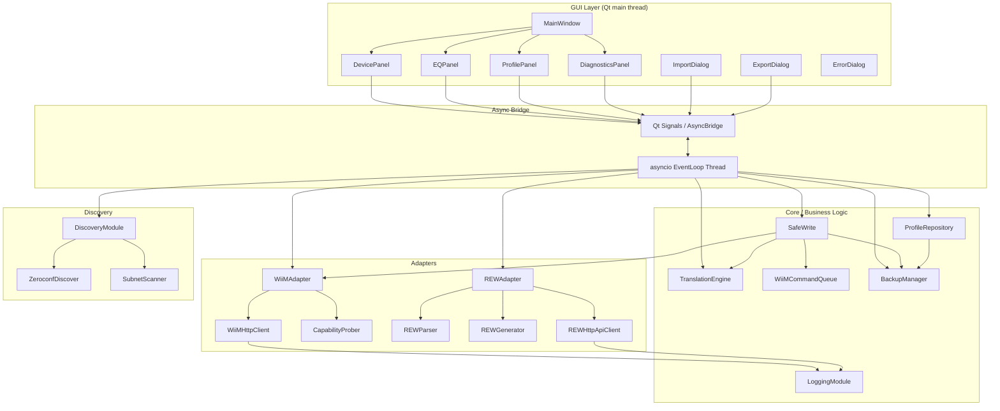
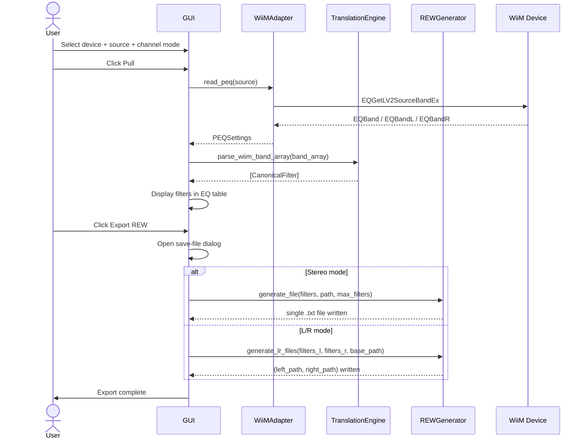

# Design Document — WiiM ↔ REW PEQ Sync Tool

## Overview

The WiiM ↔ REW PEQ Sync Tool is a cross-platform desktop application (Python 3.12+, PySide6) that transfers parametric EQ and RoomFit filter configurations between REW (Room EQ Wizard) and WiiM audio streaming devices on a local network.

The architecture is **local-first and modular**: no cloud, no external services, no direct REW-to-WiiM or WiiM-to-REW conversion. Every data exchange flows through the **Canonical Filter Model** — the single normalised intermediate representation. Every write to a device follows the **Safe Write Protocol** (Backup → Write → Read-Back → Verify → Commit/Rollback) with no exceptions.

### Key design principles

- **Canonical-only data flow**: `REW ↔ Canonical ↔ WiiM`. Direct conversion is forbidden.
- **Stateless Translation Engine**: pure functions only; no side effects, no internal state.
- **Single-writer FIFO for all device writes**: the `WiiMCommandQueue` serialises every mutating network call.
- **Non-blocking UI**: the PySide6 main thread never blocks; all I/O runs on a dedicated asyncio event loop thread.
- **Fail-safe by default**: all capability detection defaults to the most conservative value on any error.
- **Observable**: three rotating log channels capture every HTTP exchange, UI event, and error.

---

## Architecture

### Component topology



### Module layout (`src/`)

```
src/
├── models/
│   ├── __init__.py
│   ├── canonical.py          # CanonicalFilter (Pydantic)
│   ├── peq.py                # PEQBand, PEQSettings (Pydantic)
│   ├── capabilities.py       # DeviceCapabilities (Pydantic)
│   ├── profile.py            # Profile, BackupRecord (Pydantic)
│   └── errors.py             # Domain exception hierarchy
│
├── translator/
│   ├── __init__.py
│   ├── rew_parser.py         # REW text file → [CanonicalFilter]
│   ├── rew_generator.py      # [CanonicalFilter] → REW text file
│   ├── wiim_parser.py        # WiiM EQBand array → [CanonicalFilter]
│   ├── wiim_generator.py     # [CanonicalFilter] → WiiM EQBand array
│   └── schema_migrator.py    # Profile schema_version migration
│
├── utils/
│   ├── __init__.py
│   ├── fp_compare.py         # Floating-point tolerance predicates
│   └── app_dirs.py           # OS-appropriate data directory resolution
│
├── discovery/
│   ├── __init__.py
│   ├── discovery_module.py   # Orchestrates zeroconf + subnet scan
│   ├── zeroconf_discover.py  # mDNS probing via `zeroconf`
│   └── subnet_scanner.py     # Fallback subnet scan with getStatusEx probe
│
├── adapters/
│   ├── __init__.py
│   ├── wiim_http.py          # WiiMHttpClient (httpx.AsyncClient wrapper)
│   ├── capability_prober.py  # CapabilityProber
│   ├── wiim_adapter.py       # WiiMAdapter (read_peq, write_peq, etc.)
│   ├── command_queue.py      # WiiMCommandQueue (asyncio FIFO)
│   ├── safe_write.py         # SafeWrite + rollback orchestration
│   ├── rew_adapter.py        # REWAdapter facade
│   └── rew_http_client.py    # REWHttpApiClient (httpx for localhost:4735)
│
├── repository/
│   ├── __init__.py
│   ├── profile_repository.py # ProfileRepository (save/load/list/tag/etc.)
│   └── backup_manager.py     # BackupManager (pre-write backup lifecycle)
│
├── gui/
│   ├── __init__.py
│   ├── main_window.py        # QMainWindow, layout assembly
│   ├── async_bridge.py       # AsyncBridge: asyncio loop ↔ Qt signals
│   ├── panels/
│   │   ├── device_panel.py
│   │   ├── eq_panel.py
│   │   ├── profile_panel.py
│   │   └── diagnostics_panel.py
│   └── dialogs/
│       ├── import_dialog.py
│       ├── export_dialog.py
│       └── error_dialog.py
│
├── logging/
│   ├── __init__.py
│   └── setup.py              # Rotating log handler configuration
│
├── cli/
│   ├── __init__.py
│   └── main.py               # argparse entry points (Phase 5)
│
└── tests/
    ├── conftest.py
    ├── test_translator.py
    ├── test_fp_compare.py
    ├── test_discovery.py
    ├── test_wiim_adapter.py
    ├── test_rew_adapter.py
    ├── test_safe_write.py
    ├── test_profile_repository.py
    ├── test_backup_manager.py
    ├── test_command_queue.py
    └── test_cli.py
```

---

## Components and Interfaces

### Exception hierarchy (`src/models/errors.py`)

```python
class WiiMSyncError(Exception): ...          # Base for all domain errors

# Network / device
class WiiMConnectionError(WiiMSyncError): ...  # Device unreachable / timeout
class WiiMTimeoutError(WiiMConnectionError): ...
class WiiMResponseError(WiiMSyncError): ...    # Malformed or unexpected JSON response
class WiiMSlaveTargetError(WiiMSyncError): ... # Write attempted against a slave node

# Translation / parsing
class ParseError(WiiMSyncError): ...           # REW file or WiiM response unparse-able
class ValidationError(WiiMSyncError): ...      # Out-of-range or invalid value
class SchemaVersionError(WiiMSyncError): ...   # Profile schema version mismatch or migrate failure

# Repository
class ProfileNotFoundError(WiiMSyncError): ... # load() on nonexistent name
class BackupError(WiiMSyncError): ...          # Backup creation or retention failure

# Write protocol
class VerificationError(WiiMSyncError): ...    # Read-back verify failed
class RollbackError(WiiMSyncError): ...        # Rollback write also failed

# REW API
class REWNotConnectedError(WiiMSyncError): ... # Connection refused from localhost:4735
class REWMeasurementNotFoundError(WiiMSyncError): ...
```

---

### Pydantic models (`src/models/`)

#### `CanonicalFilter` (`canonical.py`)

```python
from pydantic import BaseModel, field_validator
from typing import Literal

FilterType = Literal["PEAK", "LS", "HS", "OFF"]

class CanonicalFilter(BaseModel):
    type: FilterType
    frequency_hz: float    # 10.0 – 22000.0
    gain_db: float         # -12.0 – +12.0  (WiiM hardware limit; clipping applied before write)
    q: float               # 0.01 – 24.0

    @field_validator("frequency_hz")
    def frequency_in_range(cls, v: float) -> float:
        if not (10.0 <= v <= 22000.0):
            raise ValueError(f"frequency_hz {v} out of range 10–22000 Hz")
        return v
    # gain_db and q validated similarly; clipping is applied in TranslationEngine, not here
```

#### `PEQBand` (`peq.py`)

```python
class PEQBand(BaseModel):
    letter: str            # "a"–"j"
    mode: int              # -1, 0, 1, 2
    frequency: float       # 10–22000
    q: float               # 0.01–24
    gain: float            # -12–+12
```

#### `PEQSettings` (`peq.py`)

```python
class PEQSettings(BaseModel):
    source_name: str
    enabled: bool
    channel_mode: Literal["Stereo", "L/R"]
    name: str = ""
    bands: list[PEQBand] = []         # Stereo mode
    bands_l: list[PEQBand] = []       # L/R mode — left
    bands_r: list[PEQBand] = []       # L/R mode — right
```

#### `DeviceCapabilities` (`capabilities.py`)

```python
class DeviceCapabilities(BaseModel):
    supports_peq: bool
    supports_roomfit: bool
    supports_roomfit_read: bool
    supports_roomfit_write: bool
    roomfit_level: int                 # 0–4
    supports_channel_peq: bool
    supports_profile_enumeration: bool
    supports_batch_write: bool
    max_filters: int
    model: str
    firmware: str
    uuid: str
    mac_address: str
    role: Literal["solo", "master", "slave"]
    source_names: list[str]
```

#### `Profile` and `BackupRecord` (`profile.py`)

```python
class DeviceInfo(BaseModel):
    model: str
    firmware: str
    uuid: str
    mac_address: str
    source: str
    channel_mode: Literal["Stereo", "L/R"]

class Profile(BaseModel):
    schema_version: int = 1
    profile_type: Literal["peq", "roomfit", "backup"]
    name: str
    timestamp: str                     # ISO 8601
    device: DeviceInfo
    filters: list[CanonicalFilter] | None = None       # Stereo only
    filters_l: list[CanonicalFilter] | None = None     # L/R only
    filters_r: list[CanonicalFilter] | None = None     # L/R only
    tags: list[str] = []

    @model_validator(mode="after")
    def check_filter_keys_match_channel_mode(self) -> "Profile":
        if self.device.channel_mode == "Stereo":
            if self.filters is None:
                raise ValueError("Stereo profile must have 'filters' key")
            if self.filters_l is not None or self.filters_r is not None:
                raise ValueError("Stereo profile must not have 'filters_l'/'filters_r'")
        else:  # L/R
            if self.filters_l is None or self.filters_r is None:
                raise ValueError("L/R profile must have 'filters_l' and 'filters_r'")
            if self.filters is not None:
                raise ValueError("L/R profile must not have 'filters' key")
        return self

class BackupRecord(Profile):
    profile_type: Literal["backup"] = "backup"
    trigger: Literal["pre_write", "pre_rollback"]
```

---

### `WiiMHttpClient` (`src/adapters/wiim_http.py`)

Thin `httpx.AsyncClient` wrapper. All requests use `verify=False`. Default timeout: 5 s. Every request/response pair is logged to `wiim_api.log`.

```python
class WiiMHttpClient:
    def __init__(self, ip: str, timeout: float = 5.0) -> None: ...

    async def command(self, command: str) -> dict | str:
        """
        Issue GET https://<ip>/httpapi.asp?command=<command>.
        Returns parsed JSON dict, or raw string for non-JSON responses.
        Raises:
            WiiMTimeoutError    — httpx.TimeoutException
            WiiMConnectionError — httpx.ConnectError / unreachable
            WiiMResponseError   — malformed JSON / unexpected body
        """

    async def get_status_ex(self) -> dict:
        """Convenience wrapper for getStatusEx command."""

    async def close(self) -> None:
        """Close the underlying httpx.AsyncClient."""
```

---

### `DiscoveryModule` (`src/discovery/discovery_module.py`)

```python
@dataclass
class DeviceInfo:
    ip: str
    name: str      # DeviceName
    model: str     # project field
    firmware: str  # Release field

class DiscoveryModule:
    def __init__(
        self,
        timeout: float = 5.0,
        http_client_factory: Callable[[str], WiiMHttpClient] | None = None,
    ) -> None: ...

    async def discover(self) -> list[DeviceInfo]:
        """
        Full discovery sequence:
          1. mDNS _wiim._tcp.local.
          2. If empty → mDNS _linkplay._tcp.local.
          3. If still empty → subnet scan with getStatusEx probe.
        Returns empty list (no exception) if nothing is found.
        """

    async def refresh(self) -> list[DeviceInfo]:
        """Re-run discover() and return updated list."""
```

---

### `CapabilityProber` (`src/adapters/capability_prober.py`)

```python
class CapabilityProber:
    def __init__(self, http_client: WiiMHttpClient) -> None: ...

    async def probe(self) -> DeviceCapabilities:
        """
        Probe the device and return its full DeviceCapabilities.
        Any failed or unexpected probe defaults to the most conservative value.
        Never raises — all errors produce safe defaults.
        Steps:
          1. getStatusEx → model, firmware, uuid, mac_address, source_names, role (via GetMultiroomInfo)
          2. EQGetLV2BandEx → supports_peq, supports_channel_peq
          3. EQSetLV2Band (10 bands) → supports_batch_write
          4. EQGetLV2List → supports_profile_enumeration
          5. RoomFit sequential probe (levels 0–4) → roomfit_level, supports_roomfit*
          6. max_filters = 10 if supports_peq else 0
        """
```

---

### `WiiMAdapter` (`src/adapters/wiim_adapter.py`)

```python
class WiiMAdapter:
    def __init__(
        self,
        http_client: WiiMHttpClient,
        capabilities: DeviceCapabilities,
    ) -> None: ...

    async def read_peq(
        self,
        source_name: str,
    ) -> PEQSettings:
        """
        Call EQGetLV2SourceBandEx for source_name.
        Converts EQBand / EQBandL / EQBandR arrays via wiim_parser.
        Raises WiiMResponseError if the response is missing required fields.
        Raises WiiMConnectionError if the device is unreachable.
        """

    async def write_peq(
        self,
        source_name: str,
        settings: PEQSettings,
        queue: WiiMCommandQueue,
    ) -> None:
        """
        Write PEQ bands using the queue (sequential) or batch path.
        Uses EQSetLV2SourceBand.
        Raises WiiMSlaveTargetError if this adapter's device is a slave.
        """

    async def read_roomfit(self) -> list[CanonicalFilter]:
        """Read RoomFit bands (requires roomfit_level >= 2). Returns CanonicalFilters."""

    async def write_roomfit(self, filters: list[CanonicalFilter]) -> None:
        """Write RoomFit bands (requires roomfit_level == 4)."""

    async def get_multiroom_master_ip(self) -> str | None:
        """Return master IP from GetMultiroomInfo, or None if solo/unreachable."""
```

---

### REW Adapter components

#### `REWParser` (`src/adapters/rew_adapter.py`, file-based)

```python
class REWParser:
    def parse_file(self, path: Path) -> list[CanonicalFilter]:
        """
        Parse a REW EQ text file.
        Raises ParseError on malformed lines (with line number in message).
        Raises ValidationError for unknown type tokens or out-of-range frequency.
        First line must be exactly 'Equaliser: Parametric EQ'.
        """

    def parse_filter_settings(
        self, filter_settings: list[dict]
    ) -> list[CanonicalFilter]:
        """
        Parse REW HTTP API FilterSetting objects into CanonicalFilters.
        Same validation rules as parse_file.
        """
```

#### `REWGenerator` (`src/adapters/rew_adapter.py`, file-based)

```python
class REWGenerator:
    def generate_file(
        self,
        filters: list[CanonicalFilter],
        path: Path,
        max_filters: int = 10,
    ) -> None:
        """
        Write a REW-compatible EQ text file.
        First line: 'Equaliser: Parametric EQ'
        All bands up to max_filters are written; OFF bands use 'OFF PK' format.
        Gain/freq to 2 dp, Q to 3 dp.
        """

    def generate_lr_files(
        self,
        filters_l: list[CanonicalFilter],
        filters_r: list[CanonicalFilter],
        base_path: Path,
        max_filters: int = 10,
    ) -> tuple[Path, Path]:
        """
        Write two REW files for L/R mode.
        Returns (left_path, right_path) — filenames have '_L' / '_R' suffixes.
        """
```

#### `REWHttpApiClient` (`src/adapters/rew_http_client.py`)

```python
class REWHttpApiClient:
    BASE_URL = "http://localhost:4735"

    def __init__(self, timeout: float = 5.0) -> None: ...

    async def list_measurements(self) -> list[MeasurementSummary]:
        """
        GET /measurements.
        Raises REWNotConnectedError on connection refused.
        Logs to rew_api.log.
        """

    async def get_filters(self, uuid: str) -> list[CanonicalFilter]:
        """
        GET /measurements/<uuid>/filters → parse FilterSetting objects.
        Raises REWMeasurementNotFoundError on HTTP 404.
        Raises REWNotConnectedError on connection refused.
        """
```

---

### `TranslationEngine` (`src/translator/`)

The Translation Engine is **stateless** — it has no instance state and consists of pure functions grouped into four modules. The facade class simply re-exports them for convenience.

```python
# src/translator/__init__.py — public facade

class TranslationEngine:
    """Stateless facade. All methods are pure functions (no side effects)."""

    # REW file ↔ Canonical
    @staticmethod
    def parse_rew_file(path: Path) -> list[CanonicalFilter]: ...
    @staticmethod
    def generate_rew_file(
        filters: list[CanonicalFilter],
        path: Path,
        max_filters: int = 10,
    ) -> None: ...

    # WiiM API ↔ Canonical
    @staticmethod
    def parse_wiim_band_array(
        band_array: list[dict],
        channel: Literal["stereo", "left", "right"] = "stereo",
    ) -> list[CanonicalFilter]: ...
    @staticmethod
    def generate_wiim_band_array(
        filters: list[CanonicalFilter],
    ) -> list[dict]:
        """
        Produces 40-entry parameter list (4 params × 10 bands).
        Clips gain to ±12 dB and Q to 0.01–24, logging a WARNING for each clip.
        """

    # Validation
    @staticmethod
    def validate_for_wiim(
        filters: list[CanonicalFilter],
    ) -> list[ValidationWarning]:
        """
        Returns warnings for out-of-range gain/Q values.
        Does NOT clip — clipping happens in generate_wiim_band_array.
        """

    # Schema migration
    @staticmethod
    def migrate_profile(raw: dict) -> dict:
        """
        Upgrade a Profile dict from an older schema_version to current.
        Raises SchemaVersionError if migration is impossible.
        """
```

**Internal modules** (not exposed directly — called via the facade):

| Module | Responsibility |
|---|---|
| `rew_parser.py` | `parse_rew_file()`, `parse_filter_settings()` |
| `rew_generator.py` | `generate_rew_file()`, `generate_lr_files()` |
| `wiim_parser.py` | `parse_wiim_band_array()` for stereo, left, right |
| `wiim_generator.py` | `generate_wiim_band_array()` with clipping |
| `schema_migrator.py` | `migrate_profile()` |

---

### `WiiMCommandQueue` (`src/adapters/command_queue.py`)

```python
@dataclass
class QueuedCommand:
    coro: Coroutine
    retries: int = 3
    timeout: float = 5.0

class WiiMCommandQueue:
    def __init__(self, inter_command_delay_ms: int = 100) -> None: ...

    async def enqueue(self, command: QueuedCommand) -> Any:
        """
        Add a command to the FIFO queue.
        Returns the command's result when executed.
        Raises the command's exception after max_retries exhausted.
        """

    async def start(self) -> None:
        """Start the single consumer task (asyncio.Task)."""

    async def drain_and_stop(self) -> None:
        """Wait for all queued commands to complete, then stop the consumer."""

    async def cancel(self) -> None:
        """Cancel all pending commands and stop the consumer."""
```

Reads (non-mutating `GET` commands) bypass the queue entirely and call `WiiMHttpClient.command()` directly.

---

### `SafeWrite` (`src/adapters/safe_write.py`)

```python
@dataclass
class WriteResult:
    success: bool
    failed_bands: list[int] = field(default_factory=list)  # 1-indexed band numbers
    backup_path: Path | None = None
    rollback_success: bool | None = None    # None if no rollback was attempted

class SafeWrite:
    def __init__(
        self,
        adapter: WiiMAdapter,
        backup_manager: BackupManager,
        queue: WiiMCommandQueue,
        engine: TranslationEngine,
    ) -> None: ...

    async def execute(
        self,
        source_name: str,
        intended_filters: list[CanonicalFilter],
        channel_mode: Literal["Stereo", "L/R"],
        filters_l: list[CanonicalFilter] | None = None,
        filters_r: list[CanonicalFilter] | None = None,
    ) -> WriteResult:
        """
        Full safe write sequence:
          1. Backup current device state → BackupRecord saved to disk
          2. Write intended filters via queue (or batch if supported)
          3. Read back live state via adapter.read_peq()
          4. Verify all bands within tolerance (fp_compare)
          5a. If pass → return WriteResult(success=True)
          5b. If fail → trigger rollback:
              a. Create pre_rollback backup
              b. Write backup state via queue
              c. Verify rollback write
              d. If rollback succeeds → return WriteResult(success=False, rollback_success=True)
              e. If rollback fails → log CRITICAL, return WriteResult(success=False, rollback_success=False)
        Raises WiiMSlaveTargetError if target is a slave node.
        """
```

---

### `BackupManager` (`src/repository/backup_manager.py`)

```python
class BackupManager:
    MAX_BACKUPS_PER_DEVICE = 20

    def __init__(self, storage_root: Path) -> None:
        """storage_root / 'backups' / is the backup subdirectory."""

    async def create_backup(
        self,
        settings: PEQSettings,
        capabilities: DeviceCapabilities,
        trigger: Literal["pre_write", "pre_rollback"],
    ) -> Path:
        """
        Write a BackupRecord JSON file.
        Applies retention policy: if creating this backup would result in > MAX_BACKUPS_PER_DEVICE
        for this device UUID, delete the oldest first.
        If the oldest-backup deletion fails → raise BackupError (entire backup is aborted).
        Returns the path to the newly created backup file.
        Raises BackupError if timestamp cannot be generated or file cannot be written.
        """

    def list_backups(self, device_uuid: str) -> list[Path]:
        """Return backup paths for a device UUID, sorted oldest-first."""
```

---

### `ProfileRepository` (`src/repository/profile_repository.py`)

```python
class ProfileRepository:
    def __init__(self, storage_root: Path) -> None:
        """Profiles stored in storage_root / 'profiles' /."""

    def save(self, profile: Profile) -> Path: ...
    def load(self, name: str) -> Profile:
        """Raises ProfileNotFoundError if name doesn't exist."""
    def list(self) -> list[Profile]:
        """Returns all profiles sorted by name (lexicographic, case-insensitive)."""
    def delete(self, name: str) -> None: ...
    def rename(self, old_name: str, new_name: str) -> None: ...
    def duplicate(self, name: str, new_name: str) -> Profile: ...
    def add_tag(self, name: str, tag: str) -> None: ...
    def remove_tag(self, name: str, tag: str) -> None: ...
    def get_by_tag(self, tag: str) -> list[Profile]: ...
```

Schema migration is applied automatically inside `load()` via `TranslationEngine.migrate_profile()`.

---

### `fp_compare` utilities (`src/utils/fp_compare.py`)

```python
FREQ_TOLERANCE_HZ = 0.1
GAIN_TOLERANCE_DB = 0.05
Q_TOLERANCE = 0.01

def freq_matches(a: float, b: float) -> bool:
    return abs(a - b) <= FREQ_TOLERANCE_HZ

def gain_matches(a: float, b: float) -> bool:
    return abs(a - b) <= GAIN_TOLERANCE_DB

def q_matches(a: float, b: float) -> bool:
    return abs(a - b) <= Q_TOLERANCE

def band_matches(intended: CanonicalFilter, read_back: CanonicalFilter) -> bool:
    """
    Returns True iff type, frequency, gain, and Q all match within tolerance.
    OFF bands: only type match is required.
    """
    if intended.type != read_back.type:
        return False
    if intended.type == "OFF":
        return True
    return (
        freq_matches(intended.frequency_hz, read_back.frequency_hz)
        and gain_matches(intended.gain_db, read_back.gain_db)
        and q_matches(intended.q, read_back.q)
    )
```

---

## Data Flow Diagrams

### Push (REW → WiiM)

Two paths: file import and REW HTTP API import. Both converge at the TranslationEngine.

```mermaid
sequenceDiagram
    actor User
    participant GUI
    participant TE as TranslationEngine
    participant SW as SafeWrite
    participant BM as BackupManager
    participant CQ as WiiMCommandQueue
    participant WA as WiiMAdapter
    participant Dev as WiiM Device

    User->>GUI: Select REW file / REW measurement
    GUI->>TE: parse_rew_file(path) or parse_filter_settings(...)
    TE-->>GUI: [CanonicalFilter] + ValidationWarnings

    opt Out-of-range values present
        GUI->>User: Show validation warning dialog
        User->>GUI: Acknowledge / Cancel
    end

    User->>GUI: Click Push
    GUI->>SW: execute(source, filters, channel_mode)

    SW->>WA: read_peq(source)
    WA->>Dev: EQGetLV2SourceBandEx
    Dev-->>WA: EQBand array
    WA-->>SW: PEQSettings (current state)

    SW->>BM: create_backup(settings, caps, "pre_write")
    BM-->>SW: backup_path

    SW->>TE: generate_wiim_band_array(filters)
    TE-->>SW: 40-entry param list (clipped)

    alt supports_batch_write
        SW->>WA: write_peq(source, settings)
        WA->>Dev: EQSetLV2SourceBand (single payload)
    else sequential
        loop each band
            SW->>CQ: enqueue(band_write_command)
            CQ->>Dev: EQSetLV2SourceBand (single band)
        end
    end

    SW->>WA: read_peq(source)
    WA->>Dev: EQGetLV2SourceBandEx (live read-back)
    Dev-->>WA: EQBand array (post-write)
    WA-->>SW: PEQSettings (read-back)

    SW->>TE: parse_wiim_band_array(read_back)
    TE-->>SW: [CanonicalFilter] read-back

    SW->>SW: band_matches() × 10 bands

    alt All bands pass verification
        SW-->>GUI: WriteResult(success=True)
        GUI->>User: Success notification
    else Verification failed
        SW->>BM: create_backup(current_state, caps, "pre_rollback")
        SW->>CQ: enqueue(write backup state)
        CQ->>Dev: Restore original bands
        SW->>WA: read_peq(source) — verify rollback
        alt Rollback OK
            SW-->>GUI: WriteResult(success=False, rollback_success=True)
            GUI->>User: Write failed; original state restored
        else Rollback also failed
            SW-->>GUI: WriteResult(success=False, rollback_success=False, backup_path=...)
            GUI->>User: CRITICAL error with backup_path + manual recovery steps
        end
    end
```

### Pull / Export (WiiM → REW file)



---

## GUI Component Breakdown

### `MainWindow` (`src/gui/main_window.py`)

Assembles all panels into the layout described in `architecture.md`. Creates the `AsyncBridge` and starts the background asyncio event loop thread on startup. Connects the window close event to `AsyncBridge.shutdown()`.

```
QMainWindow
└── QSplitter (vertical)
    ├── DevicePanel          (top — fixed height)
    ├── QSplitter (horizontal)
    │   ├── SourceModePanel  (left — fixed width)
    │   └── EQPanel          (right — fills remaining space)
    ├── ActionBar            (below EQ panel — fixed height)
    └── QTabWidget
        └── ProfilePanel     (tab 1)
```

Diagnostics panel lives in a `QDockWidget` (hidden by default), opened via `View → Diagnostics` menu action.

### `DevicePanel` (`src/gui/panels/device_panel.py`)

- `QListWidget` of discovered devices. Each item shows: friendly name, IP, model, firmware, multiroom role badge (solo / master / slave), and capability icons (PEQ ✓, L/R ✓, RoomFit level badge).
- **Refresh** button → emits `refresh_requested` signal → `AsyncBridge` runs `DiscoveryModule.discover()`.
- On device selection → `AsyncBridge` runs `CapabilityProber.probe()` → emits `capabilities_ready(DeviceCapabilities)` → populates all dependent panels.

Async operations: `discover()`, `probe()`.  
Qt signals emitted: `device_selected(DeviceInfo)`, `capabilities_ready(DeviceCapabilities)`, `discovery_complete(list[DeviceInfo])`.

### `EQPanel` / Source selector (`src/gui/panels/eq_panel.py`)

Contains:
- **Source selector** (`QComboBox`): populated from `capabilities.source_names` on `capabilities_ready`. No item pre-selected for write purposes; currently-active source is pre-selected for display only.
- **Channel mode selector** (`QComboBox`): Stereo / L (left) / R (right). Disabled when `supports_channel_peq=False`.
- **EQ type selector** (`QTabWidget`): PEQ tab always visible; RoomFit tab hidden when `roomfit_level == 0`.
- **Filter table** (`QTableWidget`): 10 rows × 5 columns (Band, Type, Frequency, Gain, Q). OFF bands shown in grey. Read-only when displaying live data; editable fields planned for future (Backlog).

On Pull: `AsyncBridge` runs `WiiMAdapter.read_peq()` → emits `peq_ready(PEQSettings)` → table updates.

### Action Bar

Fixed-height `QWidget` with buttons: **Import REW**, **Export REW**, **Pull**, **Push**, **Dry Run**.

- **Dry Run** toggle button. When active, a prominent "DRY RUN" label appears in the action bar (e.g. red background).
- All buttons disabled when no device/source selected; individual buttons further gated by capabilities.
- Each button click → `AsyncBridge.run_async(coroutine)` → result arrives via Qt signal.

### `ImportDialog` (`src/gui/dialogs/import_dialog.py`)

`QFileDialog` (`.txt` filter) → on file selection → synchronous `TranslationEngine.parse_rew_file()` (no async needed — pure I/O on a small file) → display filters in a preview table with any `ValidationWarning` items highlighted in orange.

If `len(filters) > max_filters`: inline warning banner with band count information. "Proceed" button disabled until user checks an acknowledgement checkbox.

### `ExportDialog` (`src/gui/dialogs/export_dialog.py`)

`QFileDialog` (save mode, `.txt` filter). In L/R mode, presents two path fields (left channel, right channel) pre-filled with `_L.txt` / `_R.txt` suffixes.

### `DiagnosticsPanel` (`src/gui/panels/diagnostics_panel.py`)

`QDockWidget`, hidden by default. Header label: **"⚠ Developer Diagnostics — Not for production use"**.

- **Raw command** input (`QLineEdit`) + Send button → `AsyncBridge.run_async(http_client.command(...))` → raw response in `QTextEdit`.
- **Capability dump** section: `QTextEdit` showing `DeviceCapabilities.model_dump_json(indent=2)`.
- **Log tail**: `QTextEdit` (read-only) tailing the last 100 lines of `wiim_api.log`.

### `ErrorDialog` (`src/gui/dialogs/error_dialog.py`)

`QDialog` with severity-specific icons. For rollback-failure errors: includes a copyable `QLabel` showing the backup file path, and a step-by-step recovery instruction block.

---

## Threading and Async Bridge

### Design

The application has **two threads**:

1. **Qt main thread**: runs the PySide6 `QApplication` event loop. No blocking calls ever.
2. **Async worker thread**: runs a dedicated `asyncio` event loop (`asyncio.new_event_loop()`). All network I/O, file-heavy operations, discovery, and write sequences run here.

Communication is **one-way** at each crossing:

- **GUI → Async**: Qt slot receives user action, calls `AsyncBridge.run_async(coro)`, which submits the coroutine to the background loop via `asyncio.run_coroutine_threadsafe()`.
- **Async → GUI**: Coroutine calls `AsyncBridge.emit_signal(signal, *args)`, which uses `QMetaObject.invokeMethod` with `Qt.ConnectionType.QueuedConnection` to safely emit the signal on the Qt thread.

### `AsyncBridge` (`src/gui/async_bridge.py`)

```python
class AsyncBridge(QObject):
    # Signals for operation results
    discovery_complete = Signal(list)           # list[DeviceInfo]
    capabilities_ready = Signal(object)         # DeviceCapabilities
    peq_ready = Signal(object)                  # PEQSettings
    write_complete = Signal(object)             # WriteResult
    rew_measurements_ready = Signal(list)       # list[MeasurementSummary]
    rew_filters_ready = Signal(list)            # list[CanonicalFilter]
    operation_error = Signal(str, str)          # (error_type, human_readable_message)
    progress_update = Signal(str)               # Status message for progress indicator
    operation_started = Signal()                # Triggers progress spinner
    operation_finished = Signal()               # Hides progress spinner

    def __init__(self, parent: QObject | None = None) -> None:
        super().__init__(parent)
        self._loop: asyncio.AbstractEventLoop | None = None
        self._thread: threading.Thread | None = None

    def start(self) -> None:
        """Start the background asyncio event loop thread."""
        self._loop = asyncio.new_event_loop()
        self._thread = threading.Thread(
            target=self._loop.run_forever,
            daemon=True,
            name="AsyncWorker",
        )
        self._thread.start()

    def run_async(self, coro: Coroutine) -> asyncio.Future:
        """
        Submit a coroutine to the background loop.
        Returns a Future (result not needed by caller — results arrive via signals).
        """
        return asyncio.run_coroutine_threadsafe(coro, self._loop)

    def shutdown(self) -> None:
        """
        Drain the WiiMCommandQueue, stop the event loop, join the thread.
        Called from MainWindow.closeEvent().
        """
```

### Progress indicator

All async operations:
1. Emit `operation_started` before the first `await`.
2. Emit `operation_finished` in a `finally` block.
3. Emit `progress_update(message)` at meaningful steps (e.g. "Backing up current state…", "Writing bands…", "Verifying…").

The `MainWindow` connects these signals to a `QProgressBar` (indeterminate mode) and a status label in the status bar.

### Cancellation

Operations that support cancellation (discovery, read, write sequence) accept a `cancel_event: asyncio.Event`. The GUI Cancel button calls `cancel_event.set()`. Each awaitable checkpoint in the coroutine checks `cancel_event.is_set()` and raises `asyncio.CancelledError` if set. The `AsyncBridge` catches `CancelledError` and emits `operation_error("cancelled", "Operation cancelled by user")`.

---

## CLI Entry Points

The CLI is a Phase 5 proof-of-concept that exercises the full stack without a GUI. Entry point: `src/cli/main.py`. Invoked as `python -m wiim_rew_sync.cli` or via the `wiim-rew-sync` console script defined in `pyproject.toml`.

### Argument structure

```
wiim-rew-sync [global options] <command> [command options]

Global options:
  --timeout FLOAT       Discovery and HTTP timeout in seconds (default: 5.0)
  --log-level LEVEL     Logging verbosity: DEBUG, INFO, WARNING, ERROR (default: INFO)

Commands:
  list-devices          Discover and list all WiiM devices on the LAN
  get-filters           Read PEQ filters from a device
  dry-run-import        Parse a REW file and preview the translation result
  set-filters           Import a REW file and write filters to a device (full safe-write)
```

#### `list-devices`

```
wiim-rew-sync list-devices
```

Output (tabular): `Name | IP | Model | Firmware | Role`. Prints `No devices found.` if empty. Exit code 0 in both cases.

#### `get-filters`

```
wiim-rew-sync get-filters --device <ip> [--source <name>] [--channel <stereo|left|right>]
```

Prints a 10-row table: `Band | Type | Frequency (Hz) | Gain (dB) | Q`. Default source: currently active source from `getStatusEx`. Exit code 0 on success, 1 on error.

#### `dry-run-import`

```
wiim-rew-sync dry-run-import --file <path>
```

Parses the REW file, translates to Canonical, prints the filter table with any WiiM range warnings. No network calls. Exit code 0 on valid file, 1 on parse/validation error.

#### `set-filters`

```
wiim-rew-sync set-filters --file <path> --device <ip> [--source <name>] [--channel <stereo|left|right>]
```

Full safe-write sequence with console progress output:
```
[1/5] Backing up current state... OK (backup: /path/to/backup.json)
[2/5] Writing 10 bands to wifi...
[3/5] Reading back device state...
[4/5] Verifying...
[5/5] Commit: all bands verified. Success.
```
On rollback success: prints rollback notification. On rollback failure: prints CRITICAL error with backup path and manual recovery steps. Exit code 0 on verified success, 1 on any failure.

---

## Data Models

All data models are defined as Pydantic v2 models in `src/models/`. The complete schema is documented in `docs/data_models.md`; the key models are summarised here for reference during design review.

| Model | Module | Purpose |
|---|---|---|
| `CanonicalFilter` | `models/canonical.py` | Single normalised EQ band — the universal exchange format |
| `PEQBand` | `models/peq.py` | Single EQ band in WiiM wire format (letter keys, mode integer) |
| `PEQSettings` | `models/peq.py` | Full PEQ state for one source: channel mode + all bands |
| `DeviceCapabilities` | `models/capabilities.py` | Runtime-probed capability set for a discovered device |
| `DeviceInfo` | `models/capabilities.py` | Lightweight struct from discovery (ip, name, model, firmware) |
| `Profile` | `models/profile.py` | Named, user-saved filter set (Stereo or L/R) |
| `BackupRecord` | `models/profile.py` | Auto-created pre-write snapshot; extends Profile with `trigger` field |
| `WriteResult` | `adapters/safe_write.py` | Outcome of a SafeWrite execution (success, failed_bands, rollback status) |
| `MeasurementSummary` | `adapters/rew_http_client.py` | Summary from REW `/measurements` endpoint (title, uuid, date, freq range) |
| `ValidationWarning` | `translator/__init__.py` | Warning from `validate_for_wiim()` — out-of-range field, band index, description |

Key invariants enforced by Pydantic validators:
- `CanonicalFilter.frequency_hz` must be in `[10.0, 22000.0]` — enforced on construction.
- `CanonicalFilter.type` must be one of `{"PEAK", "LS", "HS", "OFF"}`.
- `Profile` channel-mode / filter-key consistency is enforced by a `@model_validator` (see Components section above).
- `BackupRecord.trigger` is constrained to `{"pre_write", "pre_rollback"}`.
- `DeviceCapabilities.role` is constrained to `{"solo", "master", "slave"}`.

---

## Correctness Properties

*A correctness property is a characteristic or behavior that should hold true across all valid executions of a system — essentially, a formal statement about what the system should do. Properties serve as the bridge between human-readable specifications and machine-verifiable correctness guarantees.*

PBT is appropriate for this feature: the Translation Engine and Safe Write verification logic are pure functions with large input spaces where input variation reveals edge cases, and 100+ iterations are inexpensive (in-memory operations only).

The PBT library for this project is **[Hypothesis](https://hypothesis.readthedocs.io/)** (Python). Each test uses `@given` decorators with custom strategies and is configured with `settings(max_examples=100)` minimum.

### Property 1: REW parse-generate-parse round-trip

*For any* list of `CanonicalFilter` objects with valid field values, generating a REW text file from that list and then parsing the generated file back must produce a list of `CanonicalFilter` objects that is identical to the original (same types, frequencies, gains, and Q values, within floating-point representation).

**Validates: Requirements 16.6, 6.1, 6.3, 7.1, 7.2, 7.3, 7.4, 7.5**

### Property 2: WiiM generate-parse round-trip

*For any* list of `CanonicalFilter` objects with valid field values, converting them to a WiiM 40-entry band parameter array and then parsing that array back must produce `CanonicalFilter` objects that match the originals within the defined floating-point tolerances (frequency ±0.1 Hz, gain ±0.05 dB, Q ±0.01).

**Validates: Requirements 16.7, 4.2, 4.4, 4.5, 8.1**

### Property 3: Floating-point tolerance predicate correctness

*For any* pair of float values `(a, b)` and any parameter type (frequency, gain, Q), `band_matches()` must return `True` if and only if the absolute difference between `a` and `b` is less than or equal to the defined tolerance for that parameter type. Specifically: frequency tolerance is 0.1 Hz, gain tolerance is 0.05 dB, Q tolerance is 0.01.

**Validates: Requirements 5.6, 16.7**

### Property 4: WiiM value clipping invariant

*For any* `CanonicalFilter` object, `generate_wiim_band_array()` must always produce a parameter entry whose gain value is within [-12.0, +12.0] dB and whose Q value is within [0.01, 24.0], regardless of the input gain and Q values (which may be out of WiiM range if sourced from a wide-range REW file).

**Validates: Requirements 6.7, 6.8, 16.3, 16.4**

### Property 5: Profile channel-mode key invariant

*For any* `Profile` object, the `save()` then `load()` round-trip must preserve the correct filter key structure: a profile with `channel_mode="Stereo"` must have `filters` present and `filters_l`/`filters_r` absent; a profile with `channel_mode="L/R"` must have `filters_l` and `filters_r` present and `filters` absent. This invariant must hold for all valid `CanonicalFilter` list contents.

**Validates: Requirements 9.2, 9.3, 9.4**

### Property 6: Discovery result field completeness

*For any* `getStatusEx` response dict that contains a recognized WiiM `project` field, the `DiscoveryModule` must extract a `DeviceInfo` object that contains all four required fields: `ip`, `name`, `model`, and `firmware`. No valid WiiM response may result in a `DeviceInfo` with missing or empty required fields.

**Validates: Requirements 1.5, 1.8**

### Property 7: Profile list sort-order invariant

*For any* set of profiles with arbitrary names stored in the `ProfileRepository`, calling `list()` must return those profiles in ascending lexicographic order by name (case-insensitive). This must hold regardless of the order in which profiles were saved.

**Validates: Requirements 9.6**

## Error Handling

### Error categorisation

| Error class | Source | Handling |
|---|---|---|
| `WiiMConnectionError` / `WiiMTimeoutError` | Network | Show "Device offline" dialog; log to `app.log` at ERROR |
| `WiiMResponseError` | Network | Show generic communication error; log to `wiim_api.log` at ERROR |
| `WiiMSlaveTargetError` | Write guard | Show warning + redirect to master IP; block if master unreachable |
| `ParseError` | REW file parse | Show parse error with line number; block all device operations |
| `ValidationError` | REW file / Canonical | Show validation warning; require acknowledgement before proceeding |
| `SchemaVersionError` | Profile load | Show clear error; refuse to load profile |
| `ProfileNotFoundError` | Repository | Show "Profile not found" dialog |
| `BackupError` | Backup creation | Abort entire write operation; show error; do not proceed |
| `VerificationError` | Safe Write | Trigger rollback sequence |
| `RollbackError` | Safe Write rollback | Log CRITICAL with backup path; show critical error dialog with manual recovery |
| `REWNotConnectedError` | REW API | Show "REW not connected" status; non-fatal — all other operations continue |
| `REWMeasurementNotFoundError` | REW API | Show "Measurement not found" error |

### Rollback failure recovery (critical path)

When `RollbackError` is raised:
1. Log at CRITICAL level to `app.log`: component, timestamp, device UUID, source name, backup file path, intended filter summary.
2. `ErrorDialog` shows:
   - Header: "⚠ Critical: Device state may be incorrect"
   - Backup file path (copyable)
   - Step-by-step manual recovery: (1) open the JSON backup, (2) use the WiiM app or diagnostics panel to manually re-enter the filter values, (3) or use `--set-filters` CLI with the backup file.
3. The GUI remains functional for other operations.

### No-network startup

On startup, `DiscoveryModule.discover()` is called in the background. If it returns an empty list (e.g. no network), the `DevicePanel` shows "No devices found. Click Refresh to try again." The profile library remains fully operational.

---

## Testing Strategy

### Unit tests (`src/tests/`)

| Test file | Component | Target coverage |
|---|---|---|
| `test_fp_compare.py` | `fp_compare` utilities | 100% |
| `test_translator.py` | All translator modules | ≥ 90% (Req 16.2) |
| `test_discovery.py` | `DiscoveryModule` (mocked network) | ≥ 85% |
| `test_wiim_adapter.py` | `WiiMAdapter`, `WiiMHttpClient` (mocked httpx) | ≥ 85% |
| `test_rew_adapter.py` | `REWParser`, `REWGenerator`, `REWHttpApiClient` | ≥ 85% |
| `test_safe_write.py` | `SafeWrite` (mocked adapter + queue) | ≥ 90% |
| `test_profile_repository.py` | `ProfileRepository`, `BackupManager` | ≥ 85% |
| `test_backup_manager.py` | `BackupManager` retention policy | ≥ 90% |
| `test_command_queue.py` | `WiiMCommandQueue` sequencing, delay, retry | ≥ 90% |
| `test_cli.py` | CLI commands (mocked adapter) | ≥ 80% |

### Unit test focus areas

- **TranslationEngine**: valid inputs, boundary values, all filter types, clipping behaviour, round-trips, OFF band handling, malformed input errors.
- **SafeWrite**: all five protocol steps, batch vs sequential branch, rollback trigger, rollback failure path.
- **BackupManager**: retention policy at exactly 20, 21 backups; deletion failure propagation.
- **ProfileRepository**: Stereo/L/R schema enforcement, schema migration, sort order, tag persistence.
- **fp_compare**: exact tolerance boundaries (pass at ε, fail at ε+0.0001).

### Property-based tests

Using **Hypothesis**. Configure in `pyproject.toml`:

```toml
[tool.pytest.ini_options]
# No special config needed — Hypothesis integrates with pytest automatically.
```

Each PBT uses:
```python
from hypothesis import given, settings
from hypothesis import strategies as st

@settings(max_examples=100)
@given(...)
def test_property_N_...(...)
    # Feature: wiim-rew-sync, Property N: <property_text>
    ...
```

**Strategies to define in `conftest.py`**:
- `st_canonical_filter()`: generates `CanonicalFilter` with valid field ranges
- `st_canonical_filter_list(min_size=1, max_size=10)`: generates a list
- `st_float_near_boundary(center, tolerance)`: generates floats just inside and outside tolerance

### Mock boundaries

| Boundary | Mock approach |
|---|---|
| `httpx.AsyncClient` HTTP calls | `respx` mock router or `unittest.mock.AsyncMock` |
| `zeroconf.ServiceBrowser` | Inject fake `ServiceInfo` callbacks |
| File system (`Path.write_text`, etc.) | `tmp_path` pytest fixture |
| `asyncio` event loop timing | `asyncio.sleep` patched to zero delay in tests |
| WiiM device responses | Canned JSON fixtures in `tests/fixtures/` |

### Integration tests

Tagged `@pytest.mark.integration` and skipped in CI unless `--run-integration` flag passed:
- End-to-end CLI flow against a real WiiM device (Task 022)
- REW HTTP API client against a running REW instance

### Type checking and linting

All tests pass `mypy src/` and `ruff check src/` with zero errors as part of the standard test suite (`pyproject.toml` `[tool.mypy]` strict mode enabled for `src/translator/` and `src/models/`).

### Coverage target

```bash
pytest --cov=src/translator --cov-report=term-missing
# Required: >= 90% for src/translator/
```

Overall project target: ≥ 80% across all `src/` modules.
