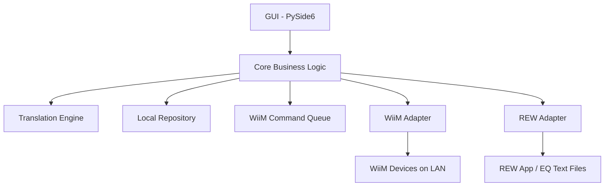

# Architecture Overview

## System Overview

The application uses a modular, local-first architecture. Direct REW-to-WiiM conversion is forbidden; all data must pass through the Canonical Filter Model.



---

## Core Components

### WiiM Adapter
- Handles all HTTP communication with WiiM devices using `httpx` (async).
- Responsible for: device discovery, `getStatusEx` reads, PEQ reads/writes, capability probing, and multiroom role detection.
- Uses `verify=False` for HTTPS due to self-signed certs.
- All calls include timeout handling. Default timeout: 5 seconds.
- All calls are logged to `wiim_api.log`.

### REW Adapter
- Handles REW EQ text file parsing and generation.
- Handles optional REW localhost HTTP API (`http://localhost:4735/`).
- All calls to the REW API are logged to `rew_api.log`.
- Gracefully handles REW not being available (connection refused = non-fatal).

### Translation Engine
- The core business component. Stateless.
- Converts REW text/API → Canonical → WiiM API format and vice versa.
- Validates all values on input (before any device interaction).
- Normalises and rounds values to WiiM hardware limits.
- Handles schema migration for stored profiles.
- Must be fully unit-tested (>90% coverage).

### Profile Repository
- Manages local JSON storage of user profiles and automatic backups.
- Storage location: OS-appropriate app data directory (e.g. `%APPDATA%\wiim-rew-sync\` on Windows, `~/.config/wiim-rew-sync/` on Linux/macOS).
- Supports: save, load, rename, delete, duplicate, tag, list, migrate schema.
- Backups are stored separately from user profiles (not visible in the profile library UI).

### WiiM Command Queue
- Enforces single-writer FIFO for all WiiM network write calls.
- Default inter-command delay: 100 ms.
- Supports: retries (up to 3), per-command timeout, cancellation.
- **Bypassed** for a batch write whenever `supports_batch_write` is not confirmed `False` — tri-state: `True` (confirmed) and `None` (undetermined, no connect-time write probe since 2026-07-10) both attempt the single-payload batch write; only a confirmed `False` uses the queued sequential path. The first `None`-state attempt records the outcome (`True`/`False`) on the capabilities object for the rest of the session. When bypassed, all of the device's bands (up to `max_filters`, not always 10 — see `docs/data_models.md`) are sent in a single payload.
- Reads (non-mutating GET commands) do not go through the queue.

### Discovery Module
- Uses `zeroconf` for mDNS discovery.
- Probes `_wiim._tcp.local.` and `_linkplay._tcp.local.` concurrently in one timeout window (not
  sequentially — see `docs/corrections.md`'s 2026-06-29 row for why sequential-with-full-timeout-each
  was a real bug).
- Secondary fallback: subnet scan with `getStatusEx` probe.
- A device is confirmed as WiiM if the `getStatusEx` response contains a recognisable `project` field.
- Discovery failures must not crash the app — show a "No devices found" state gracefully.
- **Known platform constraint:** on Windows, mDNS requires the active network to be classified
  "Private" — Windows Firewall blocks inbound multicast replies on "Public" networks, which makes
  discovery silently fall through to the (correctly-working) subnet scan every time. Not fixable
  from app code; documented in the in-app Troubleshooting guide and README.

---

## Safety & Write Architecture (Strict Protocol)

Every PEQ write operation **must** follow this exact sequence with no exceptions:

```
1. BACKUP   → Save current device PEQ state to a timestamped local JSON backup
2. WRITE    → Dispatch via WiiMCommandQueue (or single batch write if supported)
3. READ BACK → Fetch the newly-written state from the device
4. VERIFY   → Compare intended Canonical model vs. read-back Canonical model
              using floating-point tolerances (see data_models.md)
5a. COMMIT  → If verify passes: notify user of success. Backup is retained (see backup retention policy in data_models.md).
5b. ROLLBACK → If verify fails: write the backup state back to the device,
               notify user of failure and rollback outcome
```

If rollback itself fails (e.g. network drop during rollback write):
- Log a **critical** error with full context to `app.log`.
- Display an explicit user-facing message with the backup file path and manual recovery instructions.
- Do NOT silently fail.

### Two rollback shapes: RESTORE vs DELETE_NEW

The sequence above assumes a write always overwrites a pre-existing device
state, so step 5b always has something to restore. RoomFit profile writes
break that assumption — a save targets a *named* profile that may not have
existed before this write, so there are two distinct rollback shapes
(implemented in `safe_write.py`):

- **RESTORE** (`SafeWrite`, and `RoomFitSafeWrite` when the named profile
  already existed): step 1 backs up the prior state, so a verify failure
  writes that backup back and re-verifies, exactly as steps 1-5b describe
  above.
- **DELETE_NEW** (`RoomFitSafeWrite` only, when the profile is brand-new):
  there is no prior state — the profile didn't exist before this write — so
  there's nothing to restore. A verify failure instead deletes the
  just-created profile via `delete_roomfit_profile()` (`EQv2Delete` with
  `EQLevel: 2`), and `WriteResult.error_message` says so explicitly rather
  than describing a restore that didn't happen.

Both shapes still log CRITICAL and report `rollback_success=False` if the
rollback action itself fails verification.

---

## Dry Run Mode

When the user selects "Dry Run":

```
Import → Translate → Validate → Preview filters in UI → Stop
```

No network write commands are dispatched. The command queue is not invoked. The user sees the translated filter set that *would* be written, including any validation warnings.

---

## Developer Diagnostics Mode

An optional panel (accessible via menu, not visible by default) providing:

- Raw API browser: send arbitrary `httpapi.asp?command=...` requests and view raw responses
- HTTP request log viewer: shows the last N requests/responses from `wiim_api.log`
- Capability dump: displays the full `DeviceCapabilities` object for the selected device
- Protocol trace: real-time display of commands being sent during operations

This feature is intended to support debugging during development and future firmware changes. It must be clearly labelled as a developer tool in the UI.

---

## GUI Layout (PySide6)

The main window uses a wizard-based flow with a persistent sidebar for navigation:

```
┌─────────────────────────────────────────────────────────────┐
│  Main Window                                                │
├──────────┬──────────────────────────────────────────────────┤
│ Sidebar  │  Wizard Content Area (QStackedWidget)            │
│          │                                                  │
│ • Home   │  Step Indicator (Connect → EQ Type → Source →    │
│ • Presets│                   Filters → Review → Push)       │
│   on Dev │  ┌──────────────────────────────────────────┐   │
│ • My     │  │ Active Wizard Page                       │   │
│   Presets│  │ (one of 7 pages based on current step)   │   │
│ • Settings│ │                                          │   │
│          │  └──────────────────────────────────────────┘   │
│ • Help   │                                                  │
├──────────┴──────────────────────────────────────────────────┤
│  Status Banner (operation feedback)                         │
└─────────────────────────────────────────────────────────────┘
```

### Wizard Pages

| Step | Page | Purpose |
|------|------|---------|
| Connect | ConnectPage | mDNS device discovery, device card selection |
| EQ Type | EQTypePage | Choose PEQ or RoomFit (skipped for PEQ-only devices) |
| Source | SourcePage | Multi-select audio sources via checkboxes (PEQ only, skipped for RoomFit) |
| Filters | FiltersPage | Stereo/L/R mode toggle + REW file browse + import |
| Review | ReviewPage | Filter table, Dry Run toggle, Push/Export/Save actions |
| Name Profile | NameProfilePage | RoomFit profile naming (RoomFit flow only) |
| Push | PushPage | Progress stepper (Backup → Write → Verify), Undo/Export/Save on success |

### Secondary Views (via sidebar)

| View | Purpose |
|------|---------|
| Presets on Device | Browse PEQ presets and RoomFit profiles on connected device; Export/Save/Load/Copy actions |
| My Saved Presets | Local preset library with toolbar (Load/Rename/Duplicate/Delete) |
| Settings | Theme, paths, support bundle generation |
| Help (User Guide) | In-app markdown help with searchable TOC |
| Diagnostics | Raw API command browser, capability dump (developer tool, menu-accessible) |

### PEQ Workflow

1. User connects to a device (ConnectPage) → capability probe runs.
2. EQ Type page shown if device supports RoomFit; otherwise skipped (auto-PEQ).
3. Source page: multi-select one or more audio inputs (checkboxes).
4. Filters page: choose Stereo or L/R, browse REW file(s), click Next/Import.
5. Review page: inspect filter table, toggle Dry Run, push/export/save.
6. Push page: progress stepper, success with Undo/Export/Save.

### RoomFit Workflow

Steps 1–2 same as PEQ. Source step is skipped.
3. Filters page: choose Stereo or L/R, browse file(s).
4. Review page: inspect and push.
5. Name Profile page: enter profile name (warns on overwrite of existing/active).
6. Push page: same safe write protocol.

### Design Notes

- Source page shows the device's real enabled inputs via `getAudioInputEnable`
  (`CapabilityProber._probe_source_names()`), falling back to the common
  WiiM source list only for devices with no such API (currently WiiM Mini) —
  see `docs/corrections.md`, 2026-07-03.
- WiiM Mini is forced to PEQ-only flow even though it accepts RoomFit API commands (no actual hardware support).
- All async operations run via AsyncBridge (dedicated asyncio thread); GUI remains responsive.
- RoomFit toggle (enable/disable on device) has a confirmed working API
  (`EQChangeSourceFX`/`EQSourceOff` at `EQLevel:2` with an empty
  `source_name` — see `docs/wiim_api_notes.md` "RoomFit DSP Toggle —
  CONFIRMED"), but it is not wired into `WiiMAdapter` or the GUI — this is
  an intentional product decision (WiiM Home app already covers it), not a
  technical limitation. See `docs/backlog.md` item 1.

---

## Threading Model

- The GUI runs on the main thread (Qt event loop).
- All network I/O (WiiM Adapter, REW Adapter, Discovery) runs in an `asyncio` event loop on a dedicated background thread.
- Communication between GUI and async core is via Qt signals/slots or thread-safe queues.
- No blocking calls on the main thread.

---

## Logging

Three rotating log files, each capped at 10 MB with 5 retained archives:

| File | Content |
|---|---|
| `logs/app.log` | Application lifecycle, UI events, errors, rollback events |
| `logs/wiim_api.log` | All HTTP requests/responses to WiiM devices |
| `logs/rew_api.log` | All HTTP requests/responses to REW API |

All log entries include: timestamp, log level, component name, and message.
Critical events (rollback failures, unexpected API responses) are logged at ERROR or CRITICAL level.
