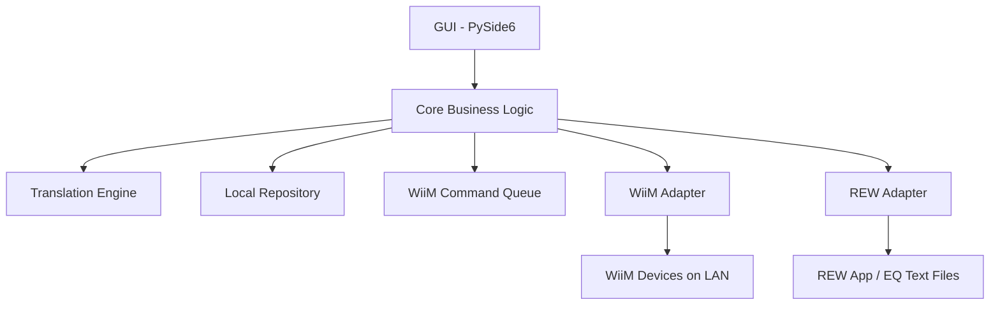

# Architecture Overview

## System Overview

The application uses a modular, local-first architecture. Direct REW-to-WiiM conversion is forbidden; all data must pass through the Canonical Filter Model.



---

## Core Components

### WiiM Adapter
- Handles all HTTP communication with WiiM devices using `httpx` (async).
- Responsible for: device discovery, `getStatusEx` reads, PEQ reads/writes, capability probing, and multiroom role detection.
- Uses `verify=False` for HTTPS due to self-signed certs.
- All calls include timeout handling. Default timeout: 5 seconds.
- All calls are logged to `wiim_api.log`.

### REW Adapter
- Handles REW EQ text file parsing and generation.
- Handles optional REW localhost HTTP API (`http://localhost:4735/`).
- All calls to the REW API are logged to `rew_api.log`.
- Gracefully handles REW not being available (connection refused = non-fatal).

### Translation Engine
- The core business component. Stateless.
- Converts REW text/API → Canonical → WiiM API format and vice versa.
- Validates all values on input (before any device interaction).
- Normalises and rounds values to WiiM hardware limits.
- Handles schema migration for stored profiles.
- Must be fully unit-tested (>90% coverage).

### Profile Repository
- Manages local JSON storage of user profiles and automatic backups.
- Storage location: OS-appropriate app data directory (e.g. `%APPDATA%\wiim-rew-sync\` on Windows, `~/.config/wiim-rew-sync/` on Linux/macOS).
- Supports: save, load, rename, delete, duplicate, tag, list, migrate schema.
- Backups are stored separately from user profiles (not visible in the profile library UI).

### WiiM Command Queue
- Enforces single-writer FIFO for all WiiM network write calls.
- Default inter-command delay: 100 ms.
- Supports: retries (up to 3), per-command timeout, cancellation.
- **Bypassed** only when `supports_batch_write` is confirmed True — in that case, all 10 bands are sent in a single payload.
- Reads (non-mutating GET commands) do not go through the queue.

### Discovery Module
- Uses `zeroconf` for mDNS discovery.
- Primary service type: `_wiim._tcp.local.`
- Fallback: `_linkplay._tcp.local.`
- Secondary fallback: subnet scan with `getStatusEx` probe.
- A device is confirmed as WiiM if the `getStatusEx` response contains a recognisable `project` field.
- Discovery failures must not crash the app — show a "No devices found" state gracefully.

---

## Safety & Write Architecture (Strict Protocol)

Every PEQ write operation **must** follow this exact sequence with no exceptions:

```
1. BACKUP   → Save current device PEQ state to a timestamped local JSON backup
2. WRITE    → Dispatch via WiiMCommandQueue (or single batch write if supported)
3. READ BACK → Fetch the newly-written state from the device
4. VERIFY   → Compare intended Canonical model vs. read-back Canonical model
              using floating-point tolerances (see data_models.md)
5a. COMMIT  → If verify passes: notify user of success. Backup is retained (see backup retention policy in data_models.md).
5b. ROLLBACK → If verify fails: write the backup state back to the device,
               notify user of failure and rollback outcome
```

If rollback itself fails (e.g. network drop during rollback write):
- Log a **critical** error with full context to `app.log`.
- Display an explicit user-facing message with the backup file path and manual recovery instructions.
- Do NOT silently fail.

---

## Dry Run Mode

When the user selects "Dry Run":

```
Import → Translate → Validate → Preview filters in UI → Stop
```

No network write commands are dispatched. The command queue is not invoked. The user sees the translated filter set that *would* be written, including any validation warnings.

---

## Developer Diagnostics Mode

An optional panel (accessible via menu, not visible by default) providing:

- Raw API browser: send arbitrary `httpapi.asp?command=...` requests and view raw responses
- HTTP request log viewer: shows the last N requests/responses from `wiim_api.log`
- Capability dump: displays the full `DeviceCapabilities` object for the selected device
- Protocol trace: real-time display of commands being sent during operations

This feature is intended to support debugging during development and future firmware changes. It must be clearly labelled as a developer tool in the UI.

---

## GUI Layout (PySide6)

The main window is divided into functional panels:

```
┌─────────────────────────────────────────────────┐
│  Device Panel (top)                             │
│  [Discovered devices list] [Refresh] [Caps]     │
├──────────────────┬──────────────────────────────┤
│  Source / Mode   │  EQ Filter Table             │
│  [Input selector]│  (10 bands, editable preview)│
│  [Stereo / L / R]│                              │
│  [PEQ / RoomFit] │                              │
├──────────────────┴──────────────────────────────┤
│  Action Bar                                     │
│  [Import REW] [Export REW] [Pull] [Push] [Dry Run] │
├─────────────────────────────────────────────────┤
│  Profile Library (tab)                          │
│  [Saved profiles, load/save/tag/delete]         │
└─────────────────────────────────────────────────┘
```

### Source selection workflow

Because PEQ is configured per input source, the user must select a source before reading or writing. The workflow is:

1. User selects a device from the Device Panel → the app fetches `InputList` from `getStatusEx`.
2. The Source selector populates with the device's available inputs (e.g. WiFi, Bluetooth, Line In).
3. User selects an input source — this sets `source_name` for all subsequent read/write operations.
4. User selects channel mode: Stereo or L/R (disabled if `supports_channel_peq=False`).
5. User selects EQ type: PEQ or RoomFit (RoomFit tab hidden if `supports_roomfit=False`, i.e. WiiM Mini).
6. Pull / Push / Import / Export all operate on the currently selected device + source + mode combination.

**The source selector must always reflect the live `InputList` from the device, not a hard-coded list.** If the device changes inputs (e.g. via firmware update), the selector updates on next device selection or refresh.

- All device writes are initiated only from the Action Bar.
- UI elements are disabled when the corresponding capability is not supported.
- RoomFit controls appear only when `roomfit_level >= 1` and are progressively enabled based on the detected level.
- All async operations run on background threads; the UI must remain responsive at all times.

---

## Threading Model

- The GUI runs on the main thread (Qt event loop).
- All network I/O (WiiM Adapter, REW Adapter, Discovery) runs in an `asyncio` event loop on a dedicated background thread.
- Communication between GUI and async core is via Qt signals/slots or thread-safe queues.
- No blocking calls on the main thread.

---

## Logging

Three rotating log files, each capped at 10 MB with 5 retained archives:

| File | Content |
|---|---|
| `logs/app.log` | Application lifecycle, UI events, errors, rollback events |
| `logs/wiim_api.log` | All HTTP requests/responses to WiiM devices |
| `logs/rew_api.log` | All HTTP requests/responses to REW API |

All log entries include: timestamp, log level, component name, and message.
Critical events (rollback failures, unexpected API responses) are logged at ERROR or CRITICAL level.
